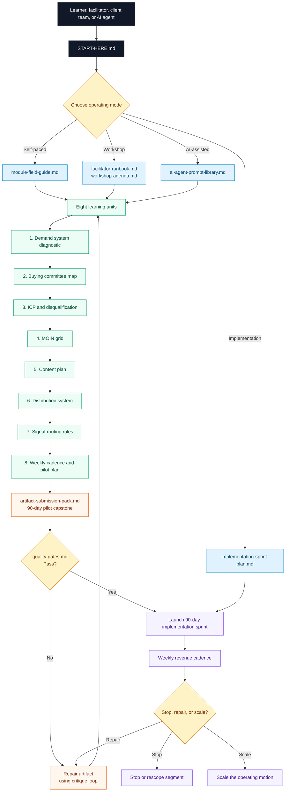

# 00: Module Visual Map

Use this diagram to orient anyone entering Module 1.

```mermaid
flowchart TD
    START["Learner, facilitator, client team, or AI agent"] --> ENTRY["START-HERE.md"]
    ENTRY --> MODE{"Choose operating mode"}

    MODE -->|Self-paced| GUIDE["module-field-guide.md"]
    MODE -->|Workshop| FACILITATOR["facilitator-runbook.md<br/>workshop-agenda.md"]
    MODE -->|AI-assisted| AI["ai-agent-prompt-library.md"]
    MODE -->|Implementation| SPRINT["implementation-sprint-plan.md"]

    GUIDE --> UNITS["Eight learning units"]
    FACILITATOR --> UNITS
    AI --> UNITS

    UNITS --> U1["1. Demand system diagnostic"]
    U1 --> U2["2. Buying committee map"]
    U2 --> U3["3. ICP and disqualification"]
    U3 --> U4["4. MOIN grid"]
    U4 --> U5["5. Content plan"]
    U5 --> U6["6. Distribution system"]
    U6 --> U7["7. Signal-routing rules"]
    U7 --> U8["8. Weekly cadence and pilot plan"]

    U8 --> CAPSTONE["artifact-submission-pack.md<br/>90-day pilot capstone"]
    CAPSTONE --> QA{"quality-gates.md<br/>Pass?"}
    QA -->|No| REPAIR["Repair artifact<br/>using critique loop"]
    REPAIR --> UNITS
    QA -->|Yes| LAUNCH["Launch 90-day implementation sprint"]
    SPRINT --> LAUNCH

    LAUNCH --> REVIEW["Weekly revenue cadence"]
    REVIEW --> DECISION{"Stop, repair, or scale?"}
    DECISION -->|Stop| STOP["Stop or rescope segment"]
    DECISION -->|Repair| REPAIR
    DECISION -->|Scale| SCALE["Scale the operating motion"]

    classDef entry fill:#111827,color:#ffffff,stroke:#374151,stroke-width:1px;
    classDef path fill:#e0f2fe,color:#0c4a6e,stroke:#0284c7,stroke-width:1px;
    classDef unit fill:#ecfdf5,color:#064e3b,stroke:#059669,stroke-width:1px;
    classDef artifact fill:#fff7ed,color:#7c2d12,stroke:#ea580c,stroke-width:1px;
    classDef decision fill:#fef3c7,color:#78350f,stroke:#d97706,stroke-width:1px;
    classDef output fill:#f5f3ff,color:#4c1d95,stroke:#7c3aed,stroke-width:1px;

    class START,ENTRY entry;
    class GUIDE,FACILITATOR,AI,SPRINT path;
    class UNITS,U1,U2,U3,U4,U5,U6,U7,U8 unit;
    class CAPSTONE,REPAIR artifact;
    class MODE,QA,DECISION decision;
    class LAUNCH,REVIEW,STOP,SCALE output;
```
