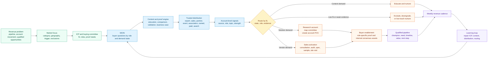

# 01: Industrial Demand Generation Operating System

Use this diagram to explain the complete operating system.

```mermaid
flowchart LR
    GOAL["Revenue problem<br/>pipeline, account movement, qualified opportunities"] --> FOCUS["Market focus<br/>category, geography, trigger, exclusions"]
    FOCUS --> ICP["ICP and buying committee<br/>fit, roles, proof needs"]
    ICP --> MOIN["MOIN<br/>buyer questions by role and demand state"]
    MOIN --> CONTENT["Content and proof engine<br/>education, comparison, validation, business case"]
    CONTENT --> DIST["Trusted distribution<br/>expert, sales, partner, event, association, owned, paid, search"]
    DIST --> SIGNALS["Account-level signals<br/>source, role, topic, strength"]
    SIGNALS --> ROUTE{"Route by fit,<br/>state, role, evidence"}
    ROUTE -->|Content demand| NURTURE["Educate and nurture"]
    ROUTE -->|Solution demand| RESEARCH["Research account<br/>map committee<br/>create account POV"]
    ROUTE -->|Vendor demand| ACTIVATE["Sales activation<br/>consultation, audit, spec, sample, site visit"]
    ROUTE -->|Low fit or weak evidence| EXCLUDE["Exclude, downgrade,<br/>or low-touch nurture"]
    NURTURE --> CADENCE["Weekly revenue cadence"]
    RESEARCH --> ENABLE["Buyer enablement<br/>role-specific proof and internal consensus assets"]
    ACTIVATE --> ENABLE
    ENABLE --> PIPELINE["Qualified pipeline<br/>champion, need, timeline, value, next step"]
    EXCLUDE --> CADENCE
    PIPELINE --> CADENCE
    CADENCE --> LEARN["Learning loop<br/>repair ICP, content, distribution, routing"]
    LEARN --> MOIN

    classDef strategy fill:#ecfdf5,color:#064e3b,stroke:#059669,stroke-width:1px;
    classDef content fill:#e0f2fe,color:#0c4a6e,stroke:#0284c7,stroke-width:1px;
    classDef decision fill:#fef3c7,color:#78350f,stroke:#d97706,stroke-width:1px;
    classDef action fill:#fff7ed,color:#7c2d12,stroke:#ea580c,stroke-width:1px;
    classDef output fill:#f5f3ff,color:#4c1d95,stroke:#7c3aed,stroke-width:1px;

    class GOAL,FOCUS,ICP strategy;
    class MOIN,CONTENT,DIST,SIGNALS content;
    class ROUTE decision;
    class NURTURE,RESEARCH,ACTIVATE,EXCLUDE,ENABLE action;
    class PIPELINE,CADENCE,LEARN output;
```
