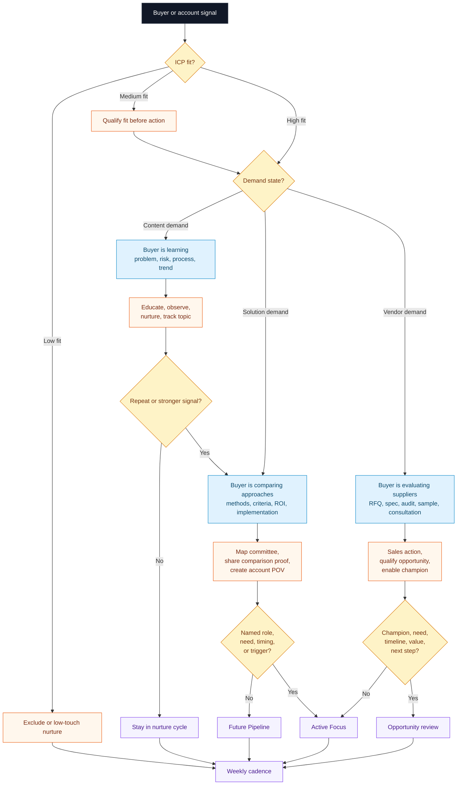

# 02: Demand States And Routing

Use this diagram to prevent the most common mistake: treating learning intent as buying intent.

```mermaid
flowchart TD
    SIGNAL["Buyer or account signal"] --> FIT{"ICP fit?"}
    FIT -->|Low fit| LOW["Exclude or low-touch nurture"]
    FIT -->|Medium fit| QUALIFY["Qualify fit before action"]
    FIT -->|High fit| STATE{"Demand state?"}

    QUALIFY --> STATE

    STATE -->|Content demand| CONTENT["Buyer is learning<br/>problem, risk, process, trend"]
    STATE -->|Solution demand| SOLUTION["Buyer is comparing approaches<br/>methods, criteria, ROI, implementation"]
    STATE -->|Vendor demand| VENDOR["Buyer is evaluating suppliers<br/>RFQ, spec, audit, sample, consultation"]

    CONTENT --> C_ACTION["Educate, observe,<br/>nurture, track topic"]
    SOLUTION --> S_ACTION["Map committee,<br/>share comparison proof,<br/>create account POV"]
    VENDOR --> V_ACTION["Sales action,<br/>qualify opportunity,<br/>enable champion"]

    C_ACTION --> NEXT_C{"Repeat or stronger signal?"}
    NEXT_C -->|No| CYCLE["Stay in nurture cycle"]
    NEXT_C -->|Yes| SOLUTION

    S_ACTION --> NEXT_S{"Named role,<br/>need, timing,<br/>or trigger?"}
    NEXT_S -->|No| FUTURE["Future Pipeline"]
    NEXT_S -->|Yes| ACTIVE["Active Focus"]

    V_ACTION --> NEXT_V{"Champion, need,<br/>timeline, value,<br/>next step?"}
    NEXT_V -->|No| ACTIVE
    NEXT_V -->|Yes| OPP["Opportunity review"]

    LOW --> CADENCE["Weekly cadence"]
    CYCLE --> CADENCE
    FUTURE --> CADENCE
    ACTIVE --> CADENCE
    OPP --> CADENCE

    classDef input fill:#111827,color:#ffffff,stroke:#374151,stroke-width:1px;
    classDef decision fill:#fef3c7,color:#78350f,stroke:#d97706,stroke-width:1px;
    classDef state fill:#e0f2fe,color:#0c4a6e,stroke:#0284c7,stroke-width:1px;
    classDef action fill:#fff7ed,color:#7c2d12,stroke:#ea580c,stroke-width:1px;
    classDef output fill:#f5f3ff,color:#4c1d95,stroke:#7c3aed,stroke-width:1px;

    class SIGNAL input;
    class FIT,STATE,NEXT_C,NEXT_S,NEXT_V decision;
    class CONTENT,SOLUTION,VENDOR state;
    class C_ACTION,S_ACTION,V_ACTION,QUALIFY,LOW action;
    class CYCLE,FUTURE,ACTIVE,OPP,CADENCE output;
```
