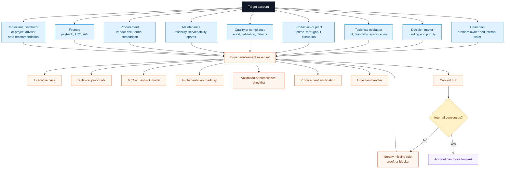

# 03: Industrial Buyer Committee Map

Use this diagram to show why industrial demand generation must educate a committee, not a single persona.

```mermaid
flowchart TD
    ACCOUNT["Target account"] --> CHAMPION["Champion<br/>problem owner and internal seller"]
    ACCOUNT --> DECISION["Decision maker<br/>funding and priority"]
    ACCOUNT --> TECH["Technical evaluator<br/>fit, feasibility, specification"]
    ACCOUNT --> PRODUCTION["Production or plant<br/>uptime, throughput, disruption"]
    ACCOUNT --> QUALITY["Quality or compliance<br/>audit, validation, defects"]
    ACCOUNT --> MAINT["Maintenance<br/>reliability, serviceability, spares"]
    ACCOUNT --> PROC["Procurement<br/>vendor risk, terms, comparison"]
    ACCOUNT --> FINANCE["Finance<br/>payback, TCO, risk"]
    ACCOUNT --> ECOSYSTEM["Consultant, distributor,<br/>or project advisor<br/>safe recommendation"]

    CHAMPION --> ASSETS["Buyer enablement asset set"]
    DECISION --> ASSETS
    TECH --> ASSETS
    PRODUCTION --> ASSETS
    QUALITY --> ASSETS
    MAINT --> ASSETS
    PROC --> ASSETS
    FINANCE --> ASSETS
    ECOSYSTEM --> ASSETS

    ASSETS --> EXEC["Executive case"]
    ASSETS --> PROOF["Technical proof note"]
    ASSETS --> TCO["TCO or payback model"]
    ASSETS --> ROADMAP["Implementation roadmap"]
    ASSETS --> VALIDATION["Validation or compliance checklist"]
    ASSETS --> PROCUREMENT["Procurement justification"]
    ASSETS --> OBJECTIONS["Objection handler"]
    ASSETS --> HUB["Content hub"]

    HUB --> CONSENSUS{"Internal consensus?"}
    CONSENSUS -->|No| GAP["Identify missing role,<br/>proof, or blocker"]
    GAP --> ASSETS
    CONSENSUS -->|Yes| MOVE["Account can move forward"]

    classDef account fill:#111827,color:#ffffff,stroke:#374151,stroke-width:1px;
    classDef role fill:#e0f2fe,color:#0c4a6e,stroke:#0284c7,stroke-width:1px;
    classDef asset fill:#fff7ed,color:#7c2d12,stroke:#ea580c,stroke-width:1px;
    classDef decision fill:#fef3c7,color:#78350f,stroke:#d97706,stroke-width:1px;
    classDef output fill:#f5f3ff,color:#4c1d95,stroke:#7c3aed,stroke-width:1px;

    class ACCOUNT account;
    class CHAMPION,DECISION,TECH,PRODUCTION,QUALITY,MAINT,PROC,FINANCE,ECOSYSTEM role;
    class ASSETS,EXEC,PROOF,TCO,ROADMAP,VALIDATION,PROCUREMENT,OBJECTIONS,HUB,GAP asset;
    class CONSENSUS decision;
    class MOVE output;
```
