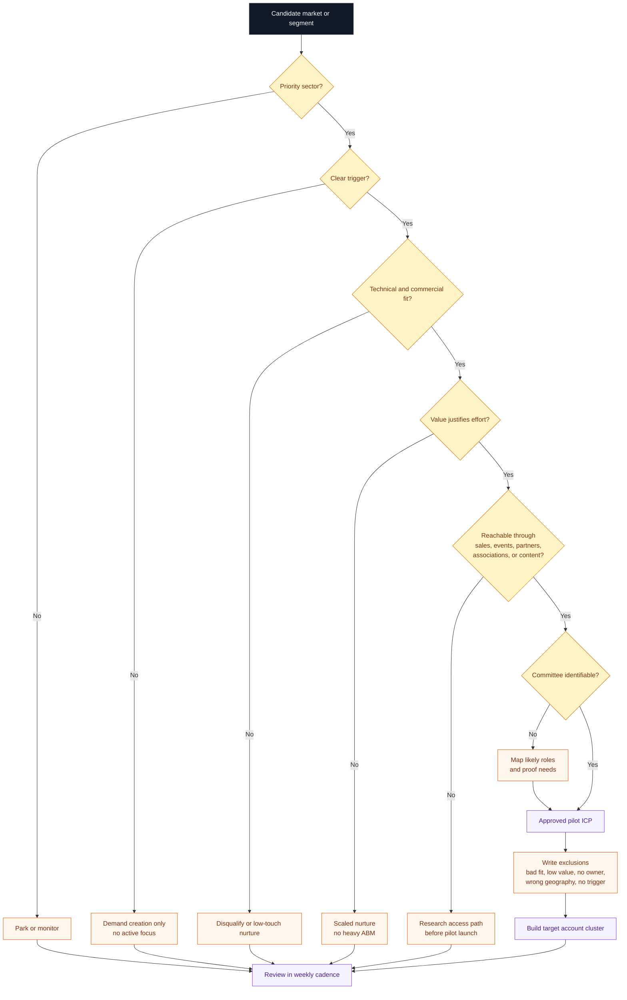

# 04: ICP Focus And Disqualification

Use this diagram to narrow the market before content, distribution, or activation work begins.

```mermaid
flowchart TD
    START["Candidate market or segment"] --> SECTOR{"Priority sector?"}
    SECTOR -->|No| PARK["Park or monitor"]
    SECTOR -->|Yes| TRIGGER{"Clear trigger?"}
    TRIGGER -->|No| EDUCATE["Demand creation only<br/>no active focus"]
    TRIGGER -->|Yes| FIT{"Technical and commercial fit?"}
    FIT -->|No| DISQUALIFY["Disqualify or low-touch nurture"]
    FIT -->|Yes| VALUE{"Value justifies effort?"}
    VALUE -->|No| SCALE_LOW["Scaled nurture<br/>no heavy ABM"]
    VALUE -->|Yes| ACCESS{"Reachable through<br/>sales, events, partners,<br/>associations, or content?"}
    ACCESS -->|No| RESEARCH["Research access path<br/>before pilot launch"]
    ACCESS -->|Yes| COMMITTEE{"Committee identifiable?"}
    COMMITTEE -->|No| MAP["Map likely roles<br/>and proof needs"]
    COMMITTEE -->|Yes| ICP["Approved pilot ICP"]

    MAP --> ICP
    ICP --> EXCLUSIONS["Write exclusions<br/>bad fit, low value, no owner,<br/>wrong geography, no trigger"]
    EXCLUSIONS --> ACCOUNT_LIST["Build target account cluster"]
    ACCOUNT_LIST --> CADENCE["Review in weekly cadence"]

    PARK --> CADENCE
    EDUCATE --> CADENCE
    DISQUALIFY --> CADENCE
    SCALE_LOW --> CADENCE
    RESEARCH --> CADENCE

    classDef input fill:#111827,color:#ffffff,stroke:#374151,stroke-width:1px;
    classDef decision fill:#fef3c7,color:#78350f,stroke:#d97706,stroke-width:1px;
    classDef action fill:#fff7ed,color:#7c2d12,stroke:#ea580c,stroke-width:1px;
    classDef output fill:#f5f3ff,color:#4c1d95,stroke:#7c3aed,stroke-width:1px;

    class START input;
    class SECTOR,TRIGGER,FIT,VALUE,ACCESS,COMMITTEE decision;
    class PARK,EDUCATE,DISQUALIFY,SCALE_LOW,RESEARCH,MAP,EXCLUSIONS action;
    class ICP,ACCOUNT_LIST,CADENCE output;
```
