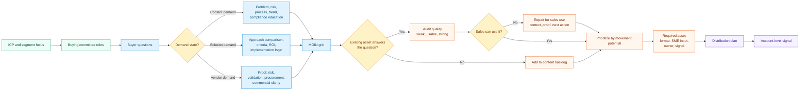

# 05: MOIN To Content Roadmap

Use this diagram to turn buyer questions into the content roadmap.

```mermaid
flowchart LR
    ICP["ICP and segment focus"] --> ROLES["Buying committee roles"]
    ROLES --> QUESTIONS["Buyer questions"]

    QUESTIONS --> STATE{"Demand state?"}
    STATE -->|Content demand| AWARE["Problem, risk,<br/>process, trend,<br/>compliance education"]
    STATE -->|Solution demand| SOLVE["Approach comparison,<br/>criteria, ROI,<br/>implementation logic"]
    STATE -->|Vendor demand| VET["Proof, risk,<br/>validation, procurement,<br/>commercial clarity"]

    AWARE --> MOIN["MOIN grid"]
    SOLVE --> MOIN
    VET --> MOIN

    MOIN --> GAP{"Existing asset answers<br/>the question?"}
    GAP -->|Yes| AUDIT["Audit quality<br/>weak, usable, strong"]
    GAP -->|No| BACKLOG["Add to content backlog"]

    AUDIT --> SALES_USE{"Sales can use it?"}
    SALES_USE -->|No| REPAIR["Repair for sales use<br/>context, proof, next action"]
    SALES_USE -->|Yes| PRIORITIZE["Prioritize by movement potential"]

    BACKLOG --> PRIORITIZE
    REPAIR --> PRIORITIZE

    PRIORITIZE --> ASSET["Required asset<br/>format, SME input,<br/>owner, signal"]
    ASSET --> DISTRIBUTE["Distribution plan"]
    DISTRIBUTE --> SIGNAL["Account-level signal"]

    classDef input fill:#ecfdf5,color:#064e3b,stroke:#059669,stroke-width:1px;
    classDef question fill:#e0f2fe,color:#0c4a6e,stroke:#0284c7,stroke-width:1px;
    classDef decision fill:#fef3c7,color:#78350f,stroke:#d97706,stroke-width:1px;
    classDef action fill:#fff7ed,color:#7c2d12,stroke:#ea580c,stroke-width:1px;
    classDef output fill:#f5f3ff,color:#4c1d95,stroke:#7c3aed,stroke-width:1px;

    class ICP,ROLES input;
    class QUESTIONS,AWARE,SOLVE,VET,MOIN question;
    class STATE,GAP,SALES_USE decision;
    class AUDIT,BACKLOG,REPAIR,PRIORITIZE,ASSET action;
    class DISTRIBUTE,SIGNAL output;
```
