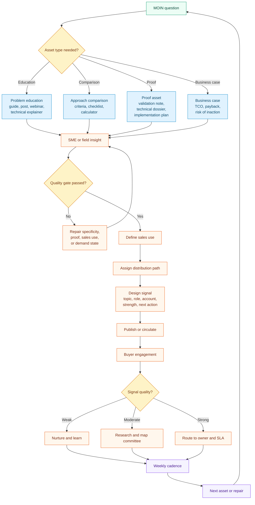

# 06: Content Engine To Signal

Use this diagram to connect content creation to account-level evidence.

```mermaid
flowchart TD
    MOIN["MOIN question"] --> ASSET{"Asset type needed?"}
    ASSET -->|Education| EDU["Problem education<br/>guide, post, webinar,<br/>technical explainer"]
    ASSET -->|Comparison| COMP["Approach comparison<br/>criteria, checklist,<br/>calculator"]
    ASSET -->|Proof| PROOF["Proof asset<br/>validation note,<br/>technical dossier,<br/>implementation plan"]
    ASSET -->|Business case| CASE["Business case<br/>TCO, payback,<br/>risk of inaction"]

    EDU --> SME["SME or field insight"]
    COMP --> SME
    PROOF --> SME
    CASE --> SME

    SME --> QUALITY{"Quality gate passed?"}
    QUALITY -->|No| REPAIR["Repair specificity,<br/>proof, sales use,<br/>or demand state"]
    REPAIR --> SME
    QUALITY -->|Yes| SALES_USE["Define sales use"]

    SALES_USE --> DIST["Assign distribution path"]
    DIST --> SIGNAL_DESIGN["Design signal<br/>topic, role, account,<br/>strength, next action"]
    SIGNAL_DESIGN --> PUBLISH["Publish or circulate"]
    PUBLISH --> ENGAGE["Buyer engagement"]
    ENGAGE --> SIGNAL{"Signal quality?"}
    SIGNAL -->|Weak| NURTURE["Nurture and learn"]
    SIGNAL -->|Moderate| RESEARCH["Research and map committee"]
    SIGNAL -->|Strong| ROUTE["Route to owner and SLA"]

    NURTURE --> CADENCE["Weekly cadence"]
    RESEARCH --> CADENCE
    ROUTE --> CADENCE
    CADENCE --> NEXT["Next asset or repair"]
    NEXT --> MOIN

    classDef input fill:#ecfdf5,color:#064e3b,stroke:#059669,stroke-width:1px;
    classDef asset fill:#e0f2fe,color:#0c4a6e,stroke:#0284c7,stroke-width:1px;
    classDef decision fill:#fef3c7,color:#78350f,stroke:#d97706,stroke-width:1px;
    classDef action fill:#fff7ed,color:#7c2d12,stroke:#ea580c,stroke-width:1px;
    classDef output fill:#f5f3ff,color:#4c1d95,stroke:#7c3aed,stroke-width:1px;

    class MOIN input;
    class EDU,COMP,PROOF,CASE asset;
    class ASSET,QUALITY,SIGNAL decision;
    class SME,REPAIR,SALES_USE,DIST,SIGNAL_DESIGN,PUBLISH,ENGAGE,NURTURE,RESEARCH,ROUTE action;
    class CADENCE,NEXT output;
```
