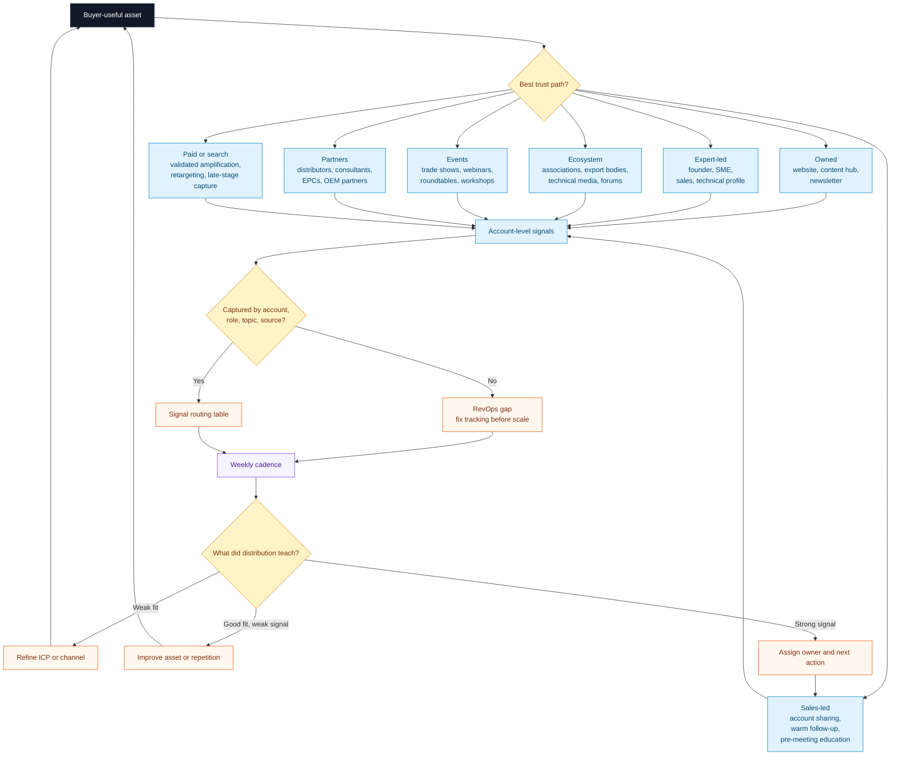

# 07: Distribution Ecosystem

Use this diagram to show why publishing alone is not distribution.

```mermaid
flowchart TD
    ASSET["Buyer-useful asset"] --> CHANNEL{"Best trust path?"}

    CHANNEL --> OWNED["Owned<br/>website, content hub,<br/>newsletter"]
    CHANNEL --> EXPERT["Expert-led<br/>founder, SME,<br/>sales, technical profile"]
    CHANNEL --> SALES["Sales-led<br/>account sharing,<br/>warm follow-up,<br/>pre-meeting education"]
    CHANNEL --> ECOSYSTEM["Ecosystem<br/>associations, export bodies,<br/>technical media, forums"]
    CHANNEL --> EVENT["Events<br/>trade shows, webinars,<br/>roundtables, workshops"]
    CHANNEL --> PARTNER["Partners<br/>distributors, consultants,<br/>EPCs, OEM partners"]
    CHANNEL --> PAID["Paid or search<br/>validated amplification,<br/>retargeting, late-stage capture"]

    OWNED --> SIGNALS["Account-level signals"]
    EXPERT --> SIGNALS
    SALES --> SIGNALS
    ECOSYSTEM --> SIGNALS
    EVENT --> SIGNALS
    PARTNER --> SIGNALS
    PAID --> SIGNALS

    SIGNALS --> CAPTURE{"Captured by account,<br/>role, topic, source?"}
    CAPTURE -->|No| OPS_GAP["RevOps gap<br/>fix tracking before scale"]
    CAPTURE -->|Yes| ROUTE["Signal routing table"]

    OPS_GAP --> CADENCE["Weekly cadence"]
    ROUTE --> CADENCE
    CADENCE --> LEARN{"What did distribution teach?"}
    LEARN -->|Weak fit| REFINE["Refine ICP or channel"]
    LEARN -->|Good fit, weak signal| IMPROVE["Improve asset or repetition"]
    LEARN -->|Strong signal| ACTIVATE["Assign owner and next action"]

    REFINE --> ASSET
    IMPROVE --> ASSET
    ACTIVATE --> SALES

    classDef input fill:#111827,color:#ffffff,stroke:#374151,stroke-width:1px;
    classDef channel fill:#e0f2fe,color:#0c4a6e,stroke:#0284c7,stroke-width:1px;
    classDef decision fill:#fef3c7,color:#78350f,stroke:#d97706,stroke-width:1px;
    classDef action fill:#fff7ed,color:#7c2d12,stroke:#ea580c,stroke-width:1px;
    classDef output fill:#f5f3ff,color:#4c1d95,stroke:#7c3aed,stroke-width:1px;

    class ASSET input;
    class OWNED,EXPERT,SALES,ECOSYSTEM,EVENT,PARTNER,PAID,SIGNALS channel;
    class CHANNEL,CAPTURE,LEARN decision;
    class OPS_GAP,ROUTE,REFINE,IMPROVE,ACTIVATE action;
    class CADENCE output;
```
