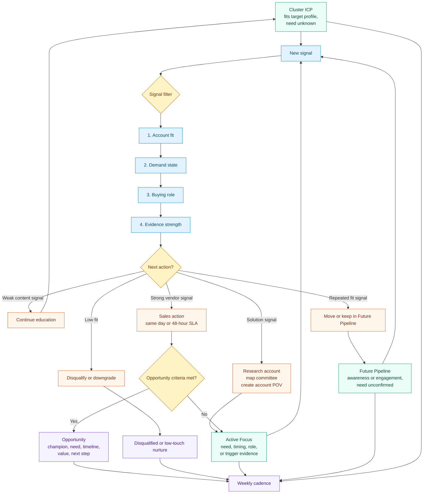

# 08: Signal Routing And Account Progression

Use this diagram to explain how accounts move through the demand system.

```mermaid
flowchart TD
    CLUSTER["Cluster ICP<br/>fits target profile,<br/>need unknown"] --> SIGNAL["New signal"]
    FUTURE["Future Pipeline<br/>awareness or engagement,<br/>need unconfirmed"] --> SIGNAL
    ACTIVE["Active Focus<br/>need, timing, role,<br/>or trigger evidence"] --> SIGNAL

    SIGNAL --> FILTER{"Signal filter"}
    FILTER --> FIT["1. Account fit"]
    FIT --> STATE["2. Demand state"]
    STATE --> ROLE["3. Buying role"]
    ROLE --> STRENGTH["4. Evidence strength"]
    STRENGTH --> DECIDE{"Next action?"}

    DECIDE -->|Weak content signal| NURTURE["Continue education"]
    DECIDE -->|Repeated fit signal| MOVE_FUTURE["Move or keep in Future Pipeline"]
    DECIDE -->|Solution signal| POV["Research account<br/>map committee<br/>create account POV"]
    DECIDE -->|Strong vendor signal| SALES["Sales action<br/>same day or 48-hour SLA"]
    DECIDE -->|Low fit| DISQUALIFY["Disqualify or downgrade"]

    NURTURE --> CLUSTER
    MOVE_FUTURE --> FUTURE
    POV --> ACTIVE
    SALES --> OPP_CHECK{"Opportunity criteria met?"}
    OPP_CHECK -->|No| ACTIVE
    OPP_CHECK -->|Yes| OPP["Opportunity<br/>champion, need, timeline,<br/>value, next step"]
    DISQUALIFY --> DISQ["Disqualified or low-touch nurture"]

    OPP --> CADENCE["Weekly cadence"]
    DISQ --> CADENCE
    ACTIVE --> CADENCE
    FUTURE --> CADENCE
    CLUSTER --> CADENCE

    classDef state fill:#ecfdf5,color:#064e3b,stroke:#059669,stroke-width:1px;
    classDef signal fill:#e0f2fe,color:#0c4a6e,stroke:#0284c7,stroke-width:1px;
    classDef decision fill:#fef3c7,color:#78350f,stroke:#d97706,stroke-width:1px;
    classDef action fill:#fff7ed,color:#7c2d12,stroke:#ea580c,stroke-width:1px;
    classDef output fill:#f5f3ff,color:#4c1d95,stroke:#7c3aed,stroke-width:1px;

    class CLUSTER,FUTURE,ACTIVE state;
    class SIGNAL,FIT,STATE,ROLE,STRENGTH signal;
    class FILTER,DECIDE,OPP_CHECK decision;
    class NURTURE,MOVE_FUTURE,POV,SALES,DISQUALIFY action;
    class OPP,DISQ,CADENCE output;
```
