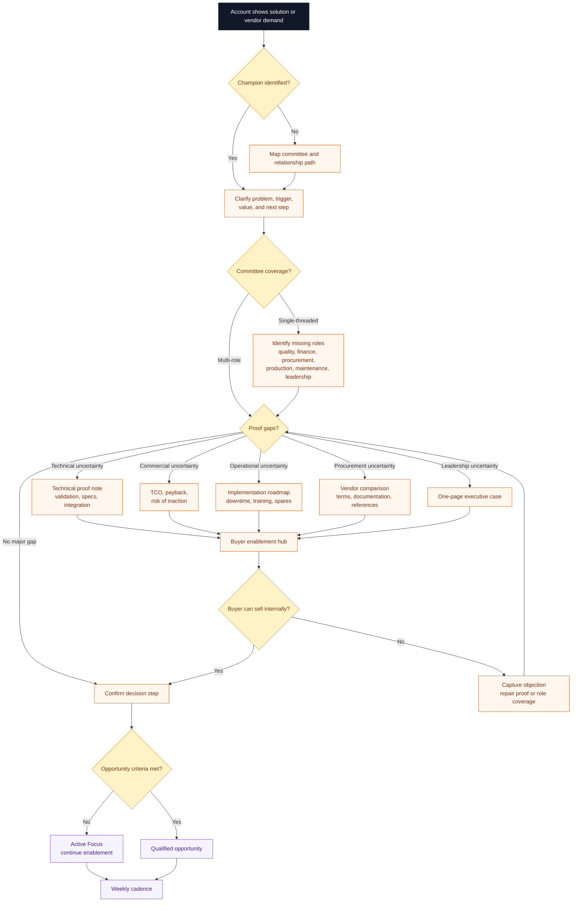

# 09: Buyer Enablement Loop

Use this diagram when deals stall after interest, technical approval, or early engagement.

```mermaid
flowchart TD
    SIGNAL["Account shows solution or vendor demand"] --> CHAMPION{"Champion identified?"}
    CHAMPION -->|No| MAP["Map committee and relationship path"]
    CHAMPION -->|Yes| NEED["Clarify problem, trigger,<br/>value, and next step"]

    MAP --> NEED
    NEED --> COMMITTEE{"Committee coverage?"}
    COMMITTEE -->|Single-threaded| MULTI["Identify missing roles<br/>quality, finance, procurement,<br/>production, maintenance, leadership"]
    COMMITTEE -->|Multi-role| PROOF{"Proof gaps?"}

    MULTI --> PROOF
    PROOF -->|Technical uncertainty| TECH["Technical proof note<br/>validation, specs, integration"]
    PROOF -->|Commercial uncertainty| ECON["TCO, payback,<br/>risk of inaction"]
    PROOF -->|Operational uncertainty| OPS["Implementation roadmap<br/>downtime, training, spares"]
    PROOF -->|Procurement uncertainty| PROC["Vendor comparison<br/>terms, documentation, references"]
    PROOF -->|Leadership uncertainty| EXEC["One-page executive case"]
    PROOF -->|No major gap| NEXT["Confirm decision step"]

    TECH --> HUB["Buyer enablement hub"]
    ECON --> HUB
    OPS --> HUB
    PROC --> HUB
    EXEC --> HUB

    HUB --> INTERNAL{"Buyer can sell internally?"}
    INTERNAL -->|No| OBJECTION["Capture objection<br/>repair proof or role coverage"]
    OBJECTION --> PROOF
    INTERNAL -->|Yes| NEXT
    NEXT --> OPP{"Opportunity criteria met?"}
    OPP -->|No| ACTIVE["Active Focus<br/>continue enablement"]
    OPP -->|Yes| PIPELINE["Qualified opportunity"]

    ACTIVE --> CADENCE["Weekly cadence"]
    PIPELINE --> CADENCE

    classDef input fill:#111827,color:#ffffff,stroke:#374151,stroke-width:1px;
    classDef decision fill:#fef3c7,color:#78350f,stroke:#d97706,stroke-width:1px;
    classDef action fill:#fff7ed,color:#7c2d12,stroke:#ea580c,stroke-width:1px;
    classDef output fill:#f5f3ff,color:#4c1d95,stroke:#7c3aed,stroke-width:1px;

    class SIGNAL input;
    class CHAMPION,COMMITTEE,PROOF,INTERNAL,OPP decision;
    class MAP,NEED,MULTI,TECH,ECON,OPS,PROC,EXEC,HUB,OBJECTION,NEXT action;
    class ACTIVE,PIPELINE,CADENCE output;
```
