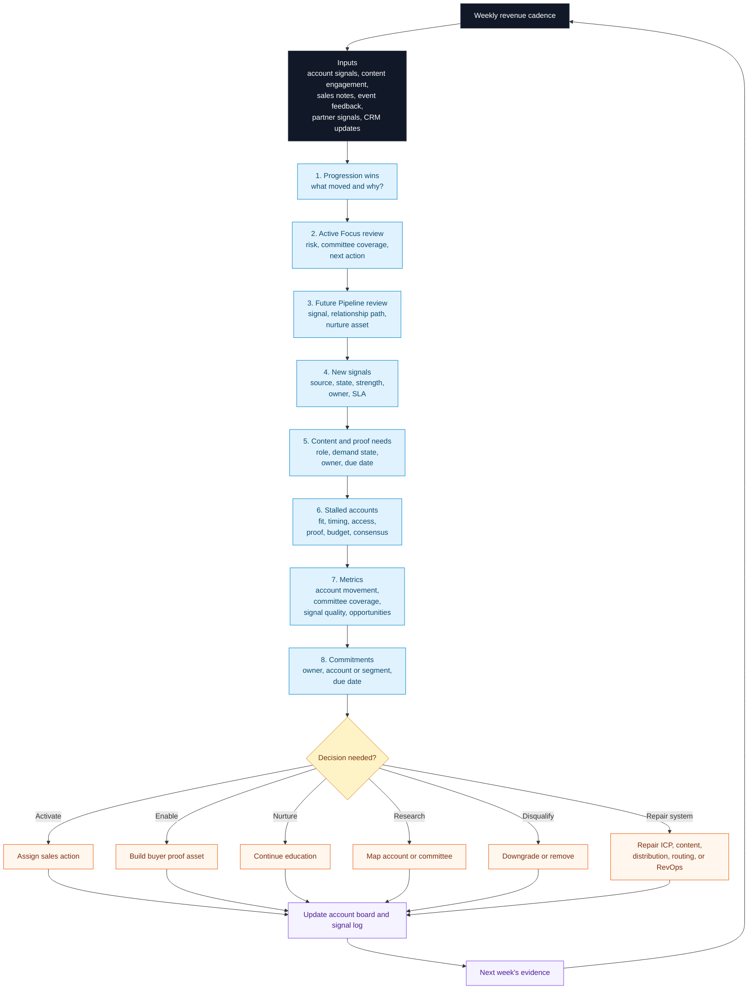

# 10: Weekly Revenue Cadence

Use this diagram to run the meeting that keeps the system real.

```mermaid
flowchart TD
    START["Weekly revenue cadence"] --> INPUTS["Inputs<br/>account signals, content engagement,<br/>sales notes, event feedback,<br/>partner signals, CRM updates"]

    INPUTS --> WINS["1. Progression wins<br/>what moved and why?"]
    WINS --> ACTIVE["2. Active Focus review<br/>risk, committee coverage,<br/>next action"]
    ACTIVE --> FUTURE["3. Future Pipeline review<br/>signal, relationship path,<br/>nurture asset"]
    FUTURE --> NEWSIG["4. New signals<br/>source, state, strength,<br/>owner, SLA"]
    NEWSIG --> PROOF["5. Content and proof needs<br/>role, demand state,<br/>owner, due date"]
    PROOF --> STALLED["6. Stalled accounts<br/>fit, timing, access,<br/>proof, budget, consensus"]
    STALLED --> METRICS["7. Metrics<br/>account movement,<br/>committee coverage,<br/>signal quality, opportunities"]
    METRICS --> COMMIT["8. Commitments<br/>owner, account or segment,<br/>due date"]

    COMMIT --> DECIDE{"Decision needed?"}
    DECIDE -->|Activate| ACTIVATE["Assign sales action"]
    DECIDE -->|Enable| ENABLE["Build buyer proof asset"]
    DECIDE -->|Nurture| NURTURE["Continue education"]
    DECIDE -->|Research| RESEARCH["Map account or committee"]
    DECIDE -->|Disqualify| DISQUALIFY["Downgrade or remove"]
    DECIDE -->|Repair system| REPAIR["Repair ICP, content,<br/>distribution, routing, or RevOps"]

    ACTIVATE --> LOG["Update account board and signal log"]
    ENABLE --> LOG
    NURTURE --> LOG
    RESEARCH --> LOG
    DISQUALIFY --> LOG
    REPAIR --> LOG

    LOG --> NEXT_WEEK["Next week's evidence"]
    NEXT_WEEK --> START

    classDef meeting fill:#111827,color:#ffffff,stroke:#374151,stroke-width:1px;
    classDef agenda fill:#e0f2fe,color:#0c4a6e,stroke:#0284c7,stroke-width:1px;
    classDef decision fill:#fef3c7,color:#78350f,stroke:#d97706,stroke-width:1px;
    classDef action fill:#fff7ed,color:#7c2d12,stroke:#ea580c,stroke-width:1px;
    classDef output fill:#f5f3ff,color:#4c1d95,stroke:#7c3aed,stroke-width:1px;

    class START,INPUTS meeting;
    class WINS,ACTIVE,FUTURE,NEWSIG,PROOF,STALLED,METRICS,COMMIT agenda;
    class DECIDE decision;
    class ACTIVATE,ENABLE,NURTURE,RESEARCH,DISQUALIFY,REPAIR action;
    class LOG,NEXT_WEEK output;
```
