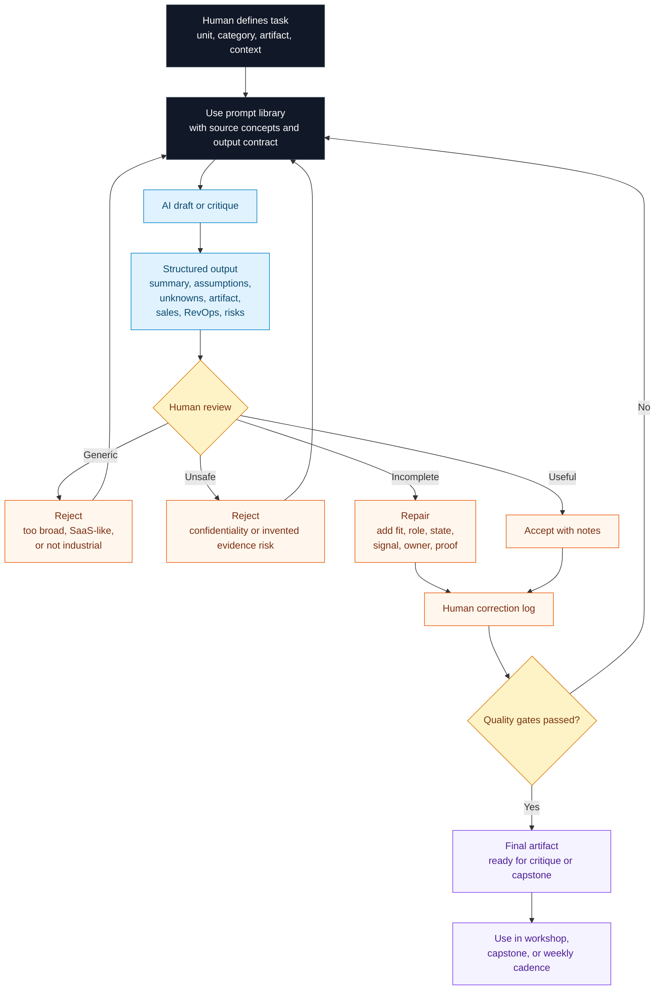

# 11: AI-Assisted Learning Loop

Use this diagram to show how AI supports the module without replacing operator judgment.

```mermaid
flowchart TD
    TASK["Human defines task<br/>unit, category, artifact, context"] --> PROMPT["Use prompt library<br/>with source concepts and output contract"]
    PROMPT --> AI["AI draft or critique"]
    AI --> OUTPUT["Structured output<br/>summary, assumptions,<br/>unknowns, artifact,<br/>sales, RevOps, risks"]

    OUTPUT --> REVIEW{"Human review"}
    REVIEW -->|Generic| REJECT["Reject<br/>too broad, SaaS-like,<br/>or not industrial"]
    REVIEW -->|Unsafe| SAFE["Reject<br/>confidentiality or invented evidence risk"]
    REVIEW -->|Incomplete| REPAIR["Repair<br/>add fit, role, state,<br/>signal, owner, proof"]
    REVIEW -->|Useful| ACCEPT["Accept with notes"]

    REJECT --> PROMPT
    SAFE --> PROMPT
    REPAIR --> HUMAN["Human correction log"]
    ACCEPT --> HUMAN

    HUMAN --> GATE{"Quality gates passed?"}
    GATE -->|No| PROMPT
    GATE -->|Yes| ARTIFACT["Final artifact<br/>ready for critique or capstone"]

    ARTIFACT --> CADENCE["Use in workshop,<br/>capstone, or weekly cadence"]

    classDef input fill:#111827,color:#ffffff,stroke:#374151,stroke-width:1px;
    classDef ai fill:#e0f2fe,color:#0c4a6e,stroke:#0284c7,stroke-width:1px;
    classDef decision fill:#fef3c7,color:#78350f,stroke:#d97706,stroke-width:1px;
    classDef action fill:#fff7ed,color:#7c2d12,stroke:#ea580c,stroke-width:1px;
    classDef output fill:#f5f3ff,color:#4c1d95,stroke:#7c3aed,stroke-width:1px;

    class TASK,PROMPT input;
    class AI,OUTPUT ai;
    class REVIEW,GATE decision;
    class REJECT,SAFE,REPAIR,ACCEPT,HUMAN action;
    class ARTIFACT,CADENCE output;
```
