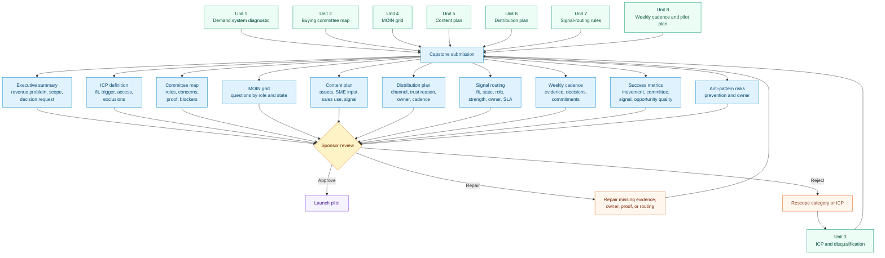

# 12: Capstone Assembly Map

Use this diagram to assemble the 90-day Industrial Demand Generation Pilot.

```mermaid
flowchart TD
    U1["Unit 1<br/>Demand system diagnostic"] --> CAPSTONE["Capstone submission"]
    U2["Unit 2<br/>Buying committee map"] --> CAPSTONE
    U3["Unit 3<br/>ICP and disqualification"] --> CAPSTONE
    U4["Unit 4<br/>MOIN grid"] --> CAPSTONE
    U5["Unit 5<br/>Content plan"] --> CAPSTONE
    U6["Unit 6<br/>Distribution plan"] --> CAPSTONE
    U7["Unit 7<br/>Signal-routing rules"] --> CAPSTONE
    U8["Unit 8<br/>Weekly cadence and pilot plan"] --> CAPSTONE

    CAPSTONE --> EXEC["Executive summary<br/>revenue problem, scope,<br/>decision request"]
    CAPSTONE --> ICP["ICP definition<br/>fit, trigger, access,<br/>exclusions"]
    CAPSTONE --> COMMITTEE["Committee map<br/>roles, concerns,<br/>proof, blockers"]
    CAPSTONE --> MOIN["MOIN grid<br/>questions by role and state"]
    CAPSTONE --> CONTENT["Content plan<br/>assets, SME input,<br/>sales use, signal"]
    CAPSTONE --> DIST["Distribution plan<br/>channel, trust reason,<br/>owner, cadence"]
    CAPSTONE --> ROUTING["Signal routing<br/>fit, state, role,<br/>strength, owner, SLA"]
    CAPSTONE --> CADENCE["Weekly cadence<br/>evidence, decisions,<br/>commitments"]
    CAPSTONE --> METRICS["Success metrics<br/>movement, committee,<br/>signal, opportunity quality"]
    CAPSTONE --> RISKS["Anti-pattern risks<br/>prevention and owner"]

    EXEC --> REVIEW{"Sponsor review"}
    ICP --> REVIEW
    COMMITTEE --> REVIEW
    MOIN --> REVIEW
    CONTENT --> REVIEW
    DIST --> REVIEW
    ROUTING --> REVIEW
    CADENCE --> REVIEW
    METRICS --> REVIEW
    RISKS --> REVIEW

    REVIEW -->|Approve| LAUNCH["Launch pilot"]
    REVIEW -->|Repair| REPAIR["Repair missing evidence,<br/>owner, proof, or routing"]
    REVIEW -->|Reject| RESCOPE["Rescope category or ICP"]

    REPAIR --> CAPSTONE
    RESCOPE --> U3

    classDef unit fill:#ecfdf5,color:#064e3b,stroke:#059669,stroke-width:1px;
    classDef artifact fill:#e0f2fe,color:#0c4a6e,stroke:#0284c7,stroke-width:1px;
    classDef decision fill:#fef3c7,color:#78350f,stroke:#d97706,stroke-width:1px;
    classDef action fill:#fff7ed,color:#7c2d12,stroke:#ea580c,stroke-width:1px;
    classDef output fill:#f5f3ff,color:#4c1d95,stroke:#7c3aed,stroke-width:1px;

    class U1,U2,U3,U4,U5,U6,U7,U8 unit;
    class CAPSTONE,EXEC,ICP,COMMITTEE,MOIN,CONTENT,DIST,ROUTING,CADENCE,METRICS,RISKS artifact;
    class REVIEW decision;
    class REPAIR,RESCOPE action;
    class LAUNCH output;
```
