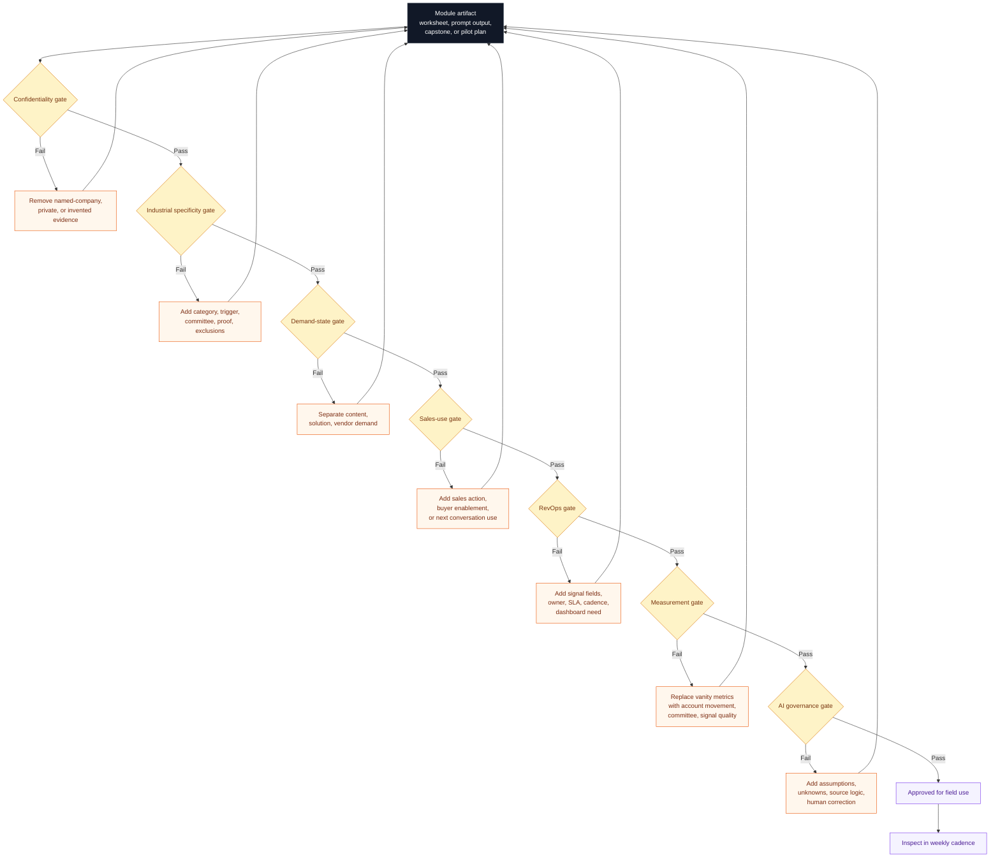

# 13: Quality Gates And Failure Modes

Use this diagram before any artifact reaches a client, sales team, leadership sponsor, or live AI agent.

```mermaid
flowchart TD
    ARTIFACT["Module artifact<br/>worksheet, prompt output,<br/>capstone, or pilot plan"] --> CONF{"Confidentiality gate"}
    CONF -->|Fail| CONF_REPAIR["Remove named-company,<br/>private, or invented evidence"]
    CONF -->|Pass| INDUSTRIAL{"Industrial specificity gate"}

    INDUSTRIAL -->|Fail| IND_REPAIR["Add category, trigger,<br/>committee, proof, exclusions"]
    INDUSTRIAL -->|Pass| STATE{"Demand-state gate"}

    STATE -->|Fail| STATE_REPAIR["Separate content,<br/>solution, vendor demand"]
    STATE -->|Pass| SALES{"Sales-use gate"}

    SALES -->|Fail| SALES_REPAIR["Add sales action,<br/>buyer enablement,<br/>or next conversation use"]
    SALES -->|Pass| REVOPS{"RevOps gate"}

    REVOPS -->|Fail| REVOPS_REPAIR["Add signal fields,<br/>owner, SLA, cadence,<br/>dashboard need"]
    REVOPS -->|Pass| MEASURE{"Measurement gate"}

    MEASURE -->|Fail| MEASURE_REPAIR["Replace vanity metrics<br/>with account movement,<br/>committee, signal quality"]
    MEASURE -->|Pass| AI{"AI governance gate"}

    AI -->|Fail| AI_REPAIR["Add assumptions,<br/>unknowns, source logic,<br/>human correction"]
    AI -->|Pass| APPROVE["Approved for field use"]

    CONF_REPAIR --> ARTIFACT
    IND_REPAIR --> ARTIFACT
    STATE_REPAIR --> ARTIFACT
    SALES_REPAIR --> ARTIFACT
    REVOPS_REPAIR --> ARTIFACT
    MEASURE_REPAIR --> ARTIFACT
    AI_REPAIR --> ARTIFACT

    APPROVE --> CADENCE["Inspect in weekly cadence"]

    classDef input fill:#111827,color:#ffffff,stroke:#374151,stroke-width:1px;
    classDef decision fill:#fef3c7,color:#78350f,stroke:#d97706,stroke-width:1px;
    classDef repair fill:#fff7ed,color:#7c2d12,stroke:#ea580c,stroke-width:1px;
    classDef output fill:#f5f3ff,color:#4c1d95,stroke:#7c3aed,stroke-width:1px;

    class ARTIFACT input;
    class CONF,INDUSTRIAL,STATE,SALES,REVOPS,MEASURE,AI decision;
    class CONF_REPAIR,IND_REPAIR,STATE_REPAIR,SALES_REPAIR,REVOPS_REPAIR,MEASURE_REPAIR,AI_REPAIR repair;
    class APPROVE,CADENCE output;
```
