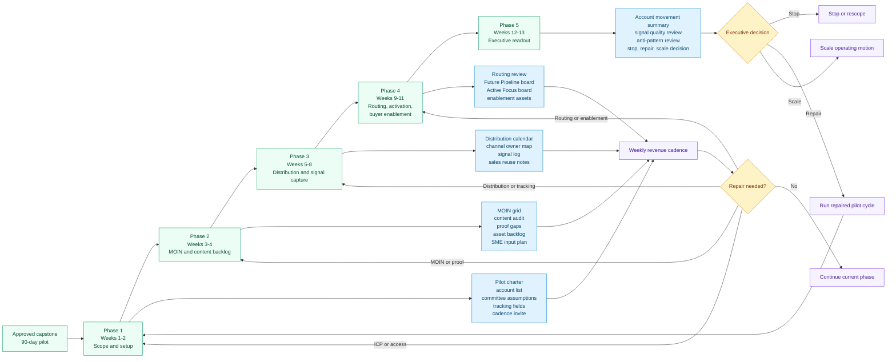

# 14: 90-Day Implementation Sprint

Use this diagram to move from academy artifact to live industrial demand generation pilot.

```mermaid
flowchart LR
    START["Approved capstone<br/>90-day pilot"] --> P1["Phase 1<br/>Weeks 1-2<br/>Scope and setup"]
    P1 --> P2["Phase 2<br/>Weeks 3-4<br/>MOIN and content backlog"]
    P2 --> P3["Phase 3<br/>Weeks 5-8<br/>Distribution and signal capture"]
    P3 --> P4["Phase 4<br/>Weeks 9-11<br/>Routing, activation,<br/>buyer enablement"]
    P4 --> P5["Phase 5<br/>Weeks 12-13<br/>Executive readout"]

    P1 --> P1_OUT["Pilot charter<br/>account list<br/>committee assumptions<br/>tracking fields<br/>cadence invite"]
    P2 --> P2_OUT["MOIN grid<br/>content audit<br/>proof gaps<br/>asset backlog<br/>SME input plan"]
    P3 --> P3_OUT["Distribution calendar<br/>channel owner map<br/>signal log<br/>sales reuse notes"]
    P4 --> P4_OUT["Routing review<br/>Future Pipeline board<br/>Active Focus board<br/>enablement assets"]
    P5 --> P5_OUT["Account movement summary<br/>signal quality review<br/>anti-pattern review<br/>stop, repair, scale decision"]

    P1_OUT --> CADENCE["Weekly revenue cadence"]
    P2_OUT --> CADENCE
    P3_OUT --> CADENCE
    P4_OUT --> CADENCE
    P5_OUT --> DECIDE{"Executive decision"}

    CADENCE --> REPAIR{"Repair needed?"}
    REPAIR -->|ICP or access| P1
    REPAIR -->|MOIN or proof| P2
    REPAIR -->|Distribution or tracking| P3
    REPAIR -->|Routing or enablement| P4
    REPAIR -->|No| CONTINUE["Continue current phase"]

    DECIDE -->|Stop| STOP["Stop or rescope"]
    DECIDE -->|Repair| REPAIR_NEXT["Run repaired pilot cycle"]
    DECIDE -->|Scale| SCALE["Scale operating motion"]

    REPAIR_NEXT --> P1

    classDef phase fill:#ecfdf5,color:#064e3b,stroke:#059669,stroke-width:1px;
    classDef artifact fill:#e0f2fe,color:#0c4a6e,stroke:#0284c7,stroke-width:1px;
    classDef decision fill:#fef3c7,color:#78350f,stroke:#d97706,stroke-width:1px;
    classDef output fill:#f5f3ff,color:#4c1d95,stroke:#7c3aed,stroke-width:1px;

    class START,P1,P2,P3,P4,P5 phase;
    class P1_OUT,P2_OUT,P3_OUT,P4_OUT,P5_OUT artifact;
    class REPAIR,DECIDE decision;
    class CADENCE,CONTINUE,STOP,REPAIR_NEXT,SCALE output;
```
