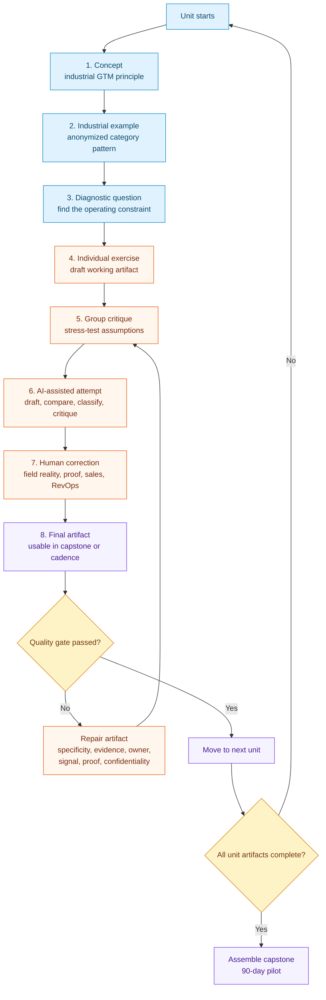

# 15: Learning Rhythm And Critique Loop

Use this diagram to run every unit as an implementation cycle, not a passive lesson.

```mermaid
flowchart TD
    START["Unit starts"] --> CONCEPT["1. Concept<br/>industrial GTM principle"]
    CONCEPT --> EXAMPLE["2. Industrial example<br/>anonymized category pattern"]
    EXAMPLE --> DIAG["3. Diagnostic question<br/>find the operating constraint"]
    DIAG --> INDIV["4. Individual exercise<br/>draft working artifact"]
    INDIV --> GROUP["5. Group critique<br/>stress-test assumptions"]
    GROUP --> AI["6. AI-assisted attempt<br/>draft, compare, classify, critique"]
    AI --> HUMAN["7. Human correction<br/>field reality, proof, sales, RevOps"]
    HUMAN --> ARTIFACT["8. Final artifact<br/>usable in capstone or cadence"]

    ARTIFACT --> GATE{"Quality gate passed?"}
    GATE -->|No| REPAIR["Repair artifact<br/>specificity, evidence, owner,<br/>signal, proof, confidentiality"]
    REPAIR --> GROUP
    GATE -->|Yes| NEXT["Move to next unit"]

    NEXT --> CAPSTONE{"All unit artifacts complete?"}
    CAPSTONE -->|No| START
    CAPSTONE -->|Yes| SUBMIT["Assemble capstone<br/>90-day pilot"]

    classDef learning fill:#e0f2fe,color:#0c4a6e,stroke:#0284c7,stroke-width:1px;
    classDef action fill:#fff7ed,color:#7c2d12,stroke:#ea580c,stroke-width:1px;
    classDef decision fill:#fef3c7,color:#78350f,stroke:#d97706,stroke-width:1px;
    classDef output fill:#f5f3ff,color:#4c1d95,stroke:#7c3aed,stroke-width:1px;

    class START,CONCEPT,EXAMPLE,DIAG learning;
    class INDIV,GROUP,AI,HUMAN,REPAIR action;
    class GATE,CAPSTONE decision;
    class ARTIFACT,NEXT,SUBMIT output;
```
