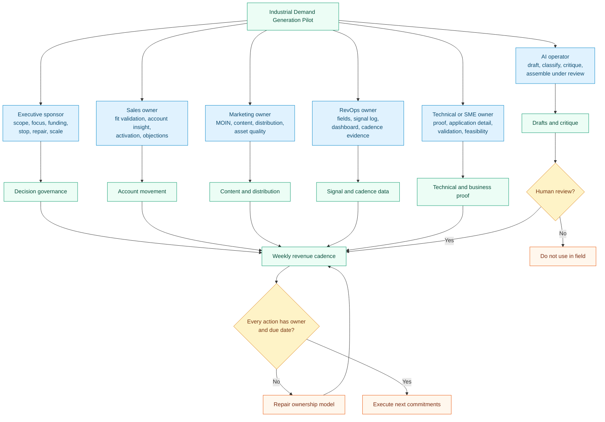

# 16: Role Operating Model

Use this diagram to clarify who owns what during the module and the 90-day pilot.

```mermaid
flowchart TD
    PILOT["Industrial Demand Generation Pilot"] --> EXEC["Executive sponsor<br/>scope, focus, funding,<br/>stop, repair, scale"]
    PILOT --> SALES["Sales owner<br/>fit validation, account insight,<br/>activation, objections"]
    PILOT --> MKT["Marketing owner<br/>MOIN, content, distribution,<br/>asset quality"]
    PILOT --> REVOPS["RevOps owner<br/>fields, signal log,<br/>dashboard, cadence evidence"]
    PILOT --> SME["Technical or SME owner<br/>proof, application detail,<br/>validation, feasibility"]
    PILOT --> AI_OP["AI operator<br/>draft, classify, critique,<br/>assemble under review"]

    EXEC --> DECISION["Decision governance"]
    SALES --> ACCOUNT["Account movement"]
    MKT --> CONTENT["Content and distribution"]
    REVOPS --> DATA["Signal and cadence data"]
    SME --> PROOF["Technical and business proof"]
    AI_OP --> DRAFTS["Drafts and critique"]

    DECISION --> CADENCE["Weekly revenue cadence"]
    ACCOUNT --> CADENCE
    CONTENT --> CADENCE
    DATA --> CADENCE
    PROOF --> CADENCE
    DRAFTS --> HUMAN_REVIEW{"Human review?"}

    HUMAN_REVIEW -->|No| BLOCK["Do not use in field"]
    HUMAN_REVIEW -->|Yes| CADENCE

    CADENCE --> OWNER_CHECK{"Every action has owner<br/>and due date?"}
    OWNER_CHECK -->|No| REPAIR["Repair ownership model"]
    OWNER_CHECK -->|Yes| EXECUTE["Execute next commitments"]
    REPAIR --> CADENCE

    classDef role fill:#e0f2fe,color:#0c4a6e,stroke:#0284c7,stroke-width:1px;
    classDef output fill:#ecfdf5,color:#064e3b,stroke:#059669,stroke-width:1px;
    classDef decision fill:#fef3c7,color:#78350f,stroke:#d97706,stroke-width:1px;
    classDef action fill:#fff7ed,color:#7c2d12,stroke:#ea580c,stroke-width:1px;

    class EXEC,SALES,MKT,REVOPS,SME,AI_OP role;
    class PILOT,DECISION,ACCOUNT,CONTENT,DATA,PROOF,DRAFTS,CADENCE output;
    class HUMAN_REVIEW,OWNER_CHECK decision;
    class BLOCK,REPAIR,EXECUTE action;
```
