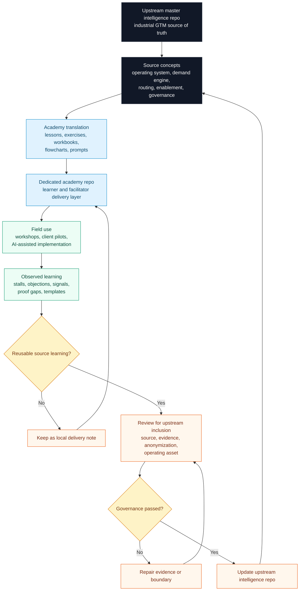

# 17: Source Lineage And Academy Governance

Use this diagram to keep the academy grounded in the upstream intelligence system.

```mermaid
flowchart TD
    UPSTREAM["Upstream master intelligence repo<br/>industrial GTM source of truth"] --> CONCEPTS["Source concepts<br/>operating system, demand engine,<br/>routing, enablement, governance"]
    CONCEPTS --> TRANSLATE["Academy translation<br/>lessons, exercises, workbooks,<br/>flowcharts, prompts"]
    TRANSLATE --> DELIVERY["Dedicated academy repo<br/>learner and facilitator delivery layer"]

    DELIVERY --> FIELD["Field use<br/>workshops, client pilots,<br/>AI-assisted implementation"]
    FIELD --> LEARNING["Observed learning<br/>stalls, objections, signals,<br/>proof gaps, templates"]
    LEARNING --> REUSABLE{"Reusable source learning?"}

    REUSABLE -->|No| LOCAL["Keep as local delivery note"]
    REUSABLE -->|Yes| SOURCE_REVIEW["Review for upstream inclusion<br/>source, evidence, anonymization,<br/>operating asset"]

    SOURCE_REVIEW --> QUALITY{"Governance passed?"}
    QUALITY -->|No| REPAIR["Repair evidence or boundary"]
    QUALITY -->|Yes| UPSTREAM_UPDATE["Update upstream intelligence repo"]

    UPSTREAM_UPDATE --> CONCEPTS
    REPAIR --> SOURCE_REVIEW
    LOCAL --> DELIVERY

    classDef source fill:#111827,color:#ffffff,stroke:#374151,stroke-width:1px;
    classDef academy fill:#e0f2fe,color:#0c4a6e,stroke:#0284c7,stroke-width:1px;
    classDef field fill:#ecfdf5,color:#064e3b,stroke:#059669,stroke-width:1px;
    classDef decision fill:#fef3c7,color:#78350f,stroke:#d97706,stroke-width:1px;
    classDef action fill:#fff7ed,color:#7c2d12,stroke:#ea580c,stroke-width:1px;

    class UPSTREAM,CONCEPTS source;
    class TRANSLATE,DELIVERY academy;
    class FIELD,LEARNING field;
    class REUSABLE,QUALITY decision;
    class LOCAL,SOURCE_REVIEW,REPAIR,UPSTREAM_UPDATE action;
```
