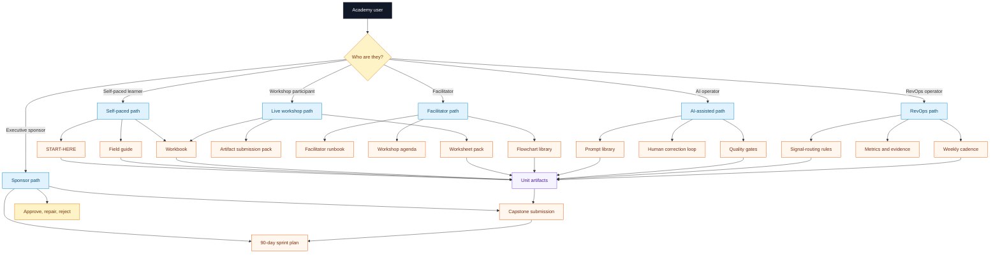

# 18: Delivery Modes And User Paths

Use this diagram to route different users through the academy without forcing everyone into the same experience.

```mermaid
flowchart TD
    USER["Academy user"] --> TYPE{"Who are they?"}

    TYPE -->|Self-paced learner| SELF["Self-paced path"]
    TYPE -->|Workshop participant| WORKSHOP["Live workshop path"]
    TYPE -->|Facilitator| FAC["Facilitator path"]
    TYPE -->|AI operator| AI["AI-assisted path"]
    TYPE -->|Executive sponsor| EXEC["Sponsor path"]
    TYPE -->|RevOps operator| REVOPS["RevOps path"]

    SELF --> START["START-HERE"]
    SELF --> GUIDE["Field guide"]
    SELF --> WORKBOOK["Workbook"]

    WORKSHOP --> WORKBOOK
    WORKSHOP --> TEMPLATES["Worksheet pack"]
    WORKSHOP --> SUBMIT["Artifact submission pack"]

    FAC --> RUNBOOK["Facilitator runbook"]
    FAC --> AGENDA["Workshop agenda"]
    FAC --> FLOW["Flowchart library"]

    AI --> PROMPTS["Prompt library"]
    AI --> QG["Quality gates"]
    AI --> REVIEW["Human correction loop"]

    EXEC --> CAPSTONE["Capstone submission"]
    EXEC --> SPRINT["90-day sprint plan"]
    EXEC --> DECISION["Approve, repair, reject"]

    REVOPS --> SIGNALS["Signal-routing rules"]
    REVOPS --> CADENCE["Weekly cadence"]
    REVOPS --> METRICS["Metrics and evidence"]

    START --> ARTIFACT["Unit artifacts"]
    GUIDE --> ARTIFACT
    WORKBOOK --> ARTIFACT
    TEMPLATES --> ARTIFACT
    FLOW --> ARTIFACT
    PROMPTS --> ARTIFACT
    QG --> ARTIFACT
    SIGNALS --> ARTIFACT
    CADENCE --> ARTIFACT

    ARTIFACT --> CAPSTONE
    CAPSTONE --> SPRINT

    classDef user fill:#111827,color:#ffffff,stroke:#374151,stroke-width:1px;
    classDef path fill:#e0f2fe,color:#0c4a6e,stroke:#0284c7,stroke-width:1px;
    classDef asset fill:#fff7ed,color:#7c2d12,stroke:#ea580c,stroke-width:1px;
    classDef output fill:#f5f3ff,color:#4c1d95,stroke:#7c3aed,stroke-width:1px;
    classDef decision fill:#fef3c7,color:#78350f,stroke:#d97706,stroke-width:1px;

    class USER user;
    class TYPE,DECISION decision;
    class SELF,WORKSHOP,FAC,AI,EXEC,REVOPS path;
    class START,GUIDE,WORKBOOK,TEMPLATES,SUBMIT,RUNBOOK,AGENDA,FLOW,PROMPTS,QG,REVIEW,CAPSTONE,SPRINT,SIGNALS,CADENCE,METRICS asset;
    class ARTIFACT output;
```
