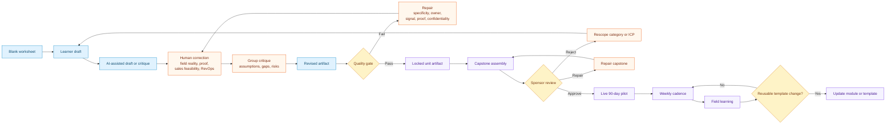

# 19: Artifact Lifecycle

Use this diagram to track how a learner artifact becomes a field-ready operating asset.

```mermaid
flowchart LR
    BLANK["Blank worksheet"] --> DRAFT["Learner draft"]
    DRAFT --> AI_DRAFT["AI-assisted draft or critique"]
    AI_DRAFT --> HUMAN["Human correction<br/>field reality, proof,<br/>sales feasibility, RevOps"]
    HUMAN --> PEER["Group critique<br/>assumptions, gaps, risks"]
    PEER --> REVISE["Revised artifact"]
    REVISE --> GATE{"Quality gate"}

    GATE -->|Fail| REPAIR["Repair<br/>specificity, owner,<br/>signal, proof, confidentiality"]
    REPAIR --> HUMAN
    GATE -->|Pass| LOCK["Locked unit artifact"]

    LOCK --> CAPSTONE["Capstone assembly"]
    CAPSTONE --> SPONSOR{"Sponsor review"}
    SPONSOR -->|Reject| RESCOPE["Rescope category or ICP"]
    SPONSOR -->|Repair| CAP_REPAIR["Repair capstone"]
    SPONSOR -->|Approve| PILOT["Live 90-day pilot"]

    RESCOPE --> DRAFT
    CAP_REPAIR --> CAPSTONE
    PILOT --> CADENCE["Weekly cadence"]
    CADENCE --> FIELD_LEARN["Field learning"]
    FIELD_LEARN --> TEMPLATE_UPDATE{"Reusable template change?"}
    TEMPLATE_UPDATE -->|No| CADENCE
    TEMPLATE_UPDATE -->|Yes| UPDATE["Update module or template"]

    classDef draft fill:#e0f2fe,color:#0c4a6e,stroke:#0284c7,stroke-width:1px;
    classDef review fill:#fff7ed,color:#7c2d12,stroke:#ea580c,stroke-width:1px;
    classDef decision fill:#fef3c7,color:#78350f,stroke:#d97706,stroke-width:1px;
    classDef output fill:#f5f3ff,color:#4c1d95,stroke:#7c3aed,stroke-width:1px;

    class BLANK,DRAFT,AI_DRAFT,REVISE draft;
    class HUMAN,PEER,REPAIR,CAP_REPAIR,RESCOPE review;
    class GATE,SPONSOR,TEMPLATE_UPDATE decision;
    class LOCK,CAPSTONE,PILOT,CADENCE,FIELD_LEARN,UPDATE output;
```
