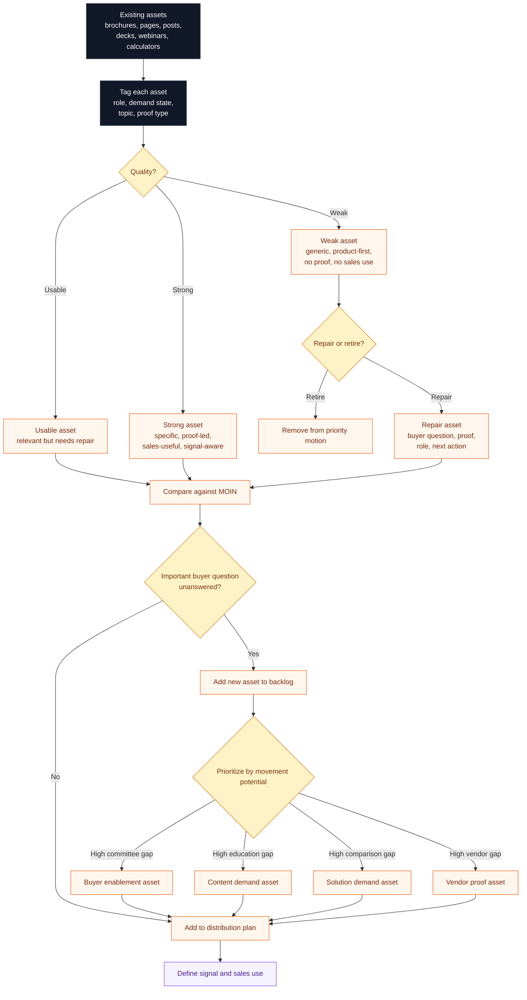

# 20: Content Audit And Gap Prioritization

Use this diagram to inspect existing content before creating more.

```mermaid
flowchart TD
    INVENTORY["Existing assets<br/>brochures, pages, posts,<br/>decks, webinars, calculators"] --> TAG["Tag each asset<br/>role, demand state,<br/>topic, proof type"]
    TAG --> QUALITY{"Quality?"}

    QUALITY -->|Weak| WEAK["Weak asset<br/>generic, product-first,<br/>no proof, no sales use"]
    QUALITY -->|Usable| USABLE["Usable asset<br/>relevant but needs repair"]
    QUALITY -->|Strong| STRONG["Strong asset<br/>specific, proof-led,<br/>sales-useful, signal-aware"]

    WEAK --> DECIDE_WEAK{"Repair or retire?"}
    DECIDE_WEAK -->|Retire| RETIRE["Remove from priority motion"]
    DECIDE_WEAK -->|Repair| REPAIR["Repair asset<br/>buyer question, proof,<br/>role, next action"]

    USABLE --> GAP["Compare against MOIN"]
    STRONG --> GAP
    REPAIR --> GAP

    GAP --> MISSING{"Important buyer question<br/>unanswered?"}
    MISSING -->|No| DISTRIBUTE["Add to distribution plan"]
    MISSING -->|Yes| BACKLOG["Add new asset to backlog"]

    BACKLOG --> PRIORITY{"Prioritize by movement potential"}
    PRIORITY -->|High committee gap| ENABLE["Buyer enablement asset"]
    PRIORITY -->|High education gap| EDUCATE["Content demand asset"]
    PRIORITY -->|High comparison gap| COMPARE["Solution demand asset"]
    PRIORITY -->|High vendor gap| PROVE["Vendor proof asset"]

    ENABLE --> DISTRIBUTE
    EDUCATE --> DISTRIBUTE
    COMPARE --> DISTRIBUTE
    PROVE --> DISTRIBUTE
    DISTRIBUTE --> SIGNAL["Define signal and sales use"]

    classDef input fill:#111827,color:#ffffff,stroke:#374151,stroke-width:1px;
    classDef decision fill:#fef3c7,color:#78350f,stroke:#d97706,stroke-width:1px;
    classDef action fill:#fff7ed,color:#7c2d12,stroke:#ea580c,stroke-width:1px;
    classDef output fill:#f5f3ff,color:#4c1d95,stroke:#7c3aed,stroke-width:1px;

    class INVENTORY,TAG input;
    class QUALITY,DECIDE_WEAK,MISSING,PRIORITY decision;
    class WEAK,USABLE,STRONG,RETIRE,REPAIR,GAP,BACKLOG,ENABLE,EDUCATE,COMPARE,PROVE,DISTRIBUTE action;
    class SIGNAL output;
```
