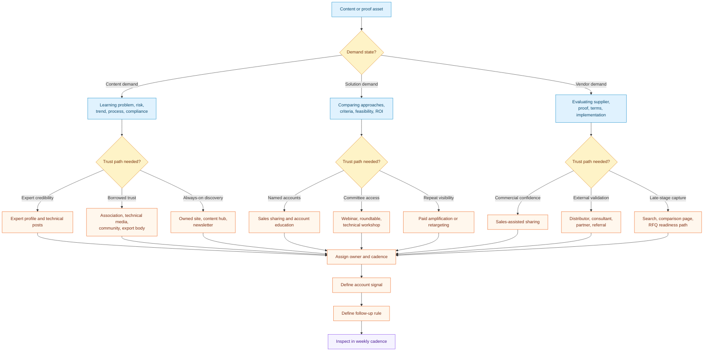

# 21: Channel Selection By Trust And Stage

Use this diagram to choose channels by buyer trust and demand state.

```mermaid
flowchart TD
    ASSET["Content or proof asset"] --> STATE{"Demand state?"}

    STATE -->|Content demand| CONTENT["Learning problem, risk,<br/>trend, process, compliance"]
    STATE -->|Solution demand| SOLUTION["Comparing approaches,<br/>criteria, feasibility, ROI"]
    STATE -->|Vendor demand| VENDOR["Evaluating supplier,<br/>proof, terms, implementation"]

    CONTENT --> TRUST_C{"Trust path needed?"}
    SOLUTION --> TRUST_S{"Trust path needed?"}
    VENDOR --> TRUST_V{"Trust path needed?"}

    TRUST_C -->|Expert credibility| EXPERT["Expert profile and technical posts"]
    TRUST_C -->|Borrowed trust| ASSOC["Association, technical media,<br/>community, export body"]
    TRUST_C -->|Always-on discovery| OWNED["Owned site, content hub,<br/>newsletter"]

    TRUST_S -->|Named accounts| SALES["Sales sharing and account education"]
    TRUST_S -->|Committee access| WEBINAR["Webinar, roundtable,<br/>technical workshop"]
    TRUST_S -->|Repeat visibility| PAID["Paid amplification or retargeting"]

    TRUST_V -->|Commercial confidence| DIRECT["Sales-assisted sharing"]
    TRUST_V -->|External validation| PARTNER["Distributor, consultant,<br/>partner, referral"]
    TRUST_V -->|Late-stage capture| SEARCH["Search, comparison page,<br/>RFQ readiness path"]

    EXPERT --> OWNER["Assign owner and cadence"]
    ASSOC --> OWNER
    OWNED --> OWNER
    SALES --> OWNER
    WEBINAR --> OWNER
    PAID --> OWNER
    DIRECT --> OWNER
    PARTNER --> OWNER
    SEARCH --> OWNER

    OWNER --> SIGNAL["Define account signal"]
    SIGNAL --> FOLLOW["Define follow-up rule"]
    FOLLOW --> CADENCE["Inspect in weekly cadence"]

    classDef state fill:#e0f2fe,color:#0c4a6e,stroke:#0284c7,stroke-width:1px;
    classDef decision fill:#fef3c7,color:#78350f,stroke:#d97706,stroke-width:1px;
    classDef channel fill:#fff7ed,color:#7c2d12,stroke:#ea580c,stroke-width:1px;
    classDef output fill:#f5f3ff,color:#4c1d95,stroke:#7c3aed,stroke-width:1px;

    class ASSET,CONTENT,SOLUTION,VENDOR state;
    class STATE,TRUST_C,TRUST_S,TRUST_V decision;
    class EXPERT,ASSOC,OWNED,SALES,WEBINAR,PAID,DIRECT,PARTNER,SEARCH,OWNER,SIGNAL,FOLLOW channel;
    class CADENCE output;
```
