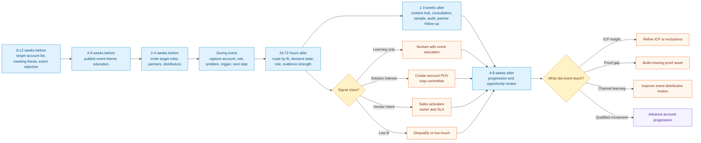

# 22: Event And Trade Show Demand Motion

Use this diagram to turn events into account progression systems, not badge collection.

```mermaid
flowchart LR
    PLAN["8-12 weeks before<br/>target account list,<br/>meeting thesis, event objective"] --> EDUCATE["4-8 weeks before<br/>publish event-theme education"]
    EDUCATE --> INVITE["2-4 weeks before<br/>invite target roles,<br/>partners, distributors"]
    INVITE --> EVENT["During event<br/>capture account, role,<br/>problem, trigger, next step"]
    EVENT --> ROUTE["24-72 hours after<br/>route by fit, demand state,<br/>role, evidence strength"]
    ROUTE --> FOLLOW["1-3 weeks after<br/>content hub, consultation,<br/>sample, audit, partner follow-up"]
    FOLLOW --> REVIEW["4-8 weeks after<br/>progression and opportunity review"]

    ROUTE --> DECIDE{"Signal class?"}
    DECIDE -->|Learning only| NURTURE["Nurture with event education"]
    DECIDE -->|Solution interest| POV["Create account POV<br/>map committee"]
    DECIDE -->|Vendor intent| SALES["Sales activation<br/>owner and SLA"]
    DECIDE -->|Low fit| DISQUALIFY["Disqualify or low-touch"]

    NURTURE --> REVIEW
    POV --> REVIEW
    SALES --> REVIEW
    DISQUALIFY --> REVIEW

    REVIEW --> LEARN{"What did event teach?"}
    LEARN -->|ICP insight| ICP["Refine ICP or exclusions"]
    LEARN -->|Proof gap| PROOF["Build missing proof asset"]
    LEARN -->|Channel learning| DIST["Improve event distribution motion"]
    LEARN -->|Qualified movement| PIPELINE["Advance account progression"]

    classDef phase fill:#e0f2fe,color:#0c4a6e,stroke:#0284c7,stroke-width:1px;
    classDef decision fill:#fef3c7,color:#78350f,stroke:#d97706,stroke-width:1px;
    classDef action fill:#fff7ed,color:#7c2d12,stroke:#ea580c,stroke-width:1px;
    classDef output fill:#f5f3ff,color:#4c1d95,stroke:#7c3aed,stroke-width:1px;

    class PLAN,EDUCATE,INVITE,EVENT,ROUTE,FOLLOW,REVIEW phase;
    class DECIDE,LEARN decision;
    class NURTURE,POV,SALES,DISQUALIFY,ICP,PROOF,DIST action;
    class PIPELINE output;
```
