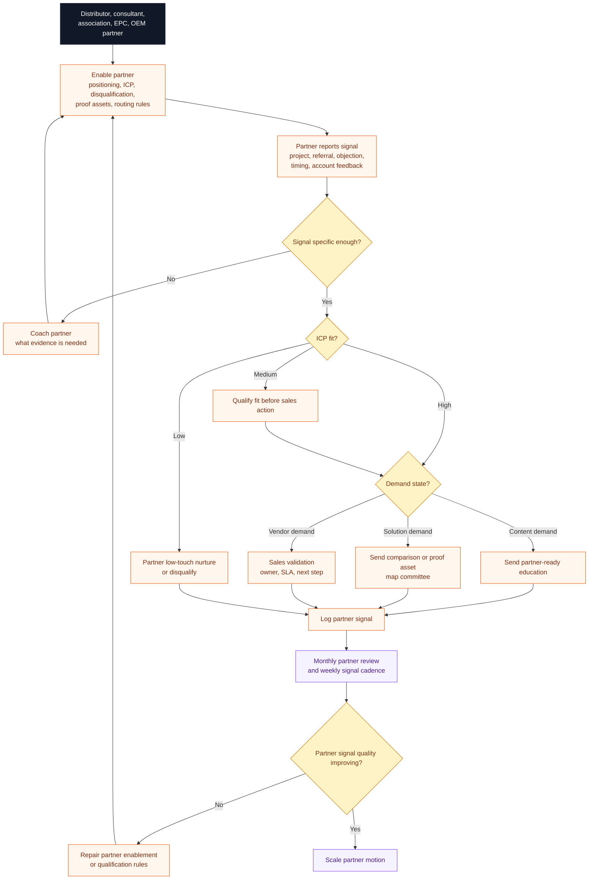

# 23: Distributor And Partner Signal Motion

Use this diagram to make partner and distributor input operational.

```mermaid
flowchart TD
    PARTNER["Distributor, consultant,<br/>association, EPC, OEM partner"] --> TRAIN["Enable partner<br/>positioning, ICP, disqualification,<br/>proof assets, routing rules"]
    TRAIN --> SIGNAL["Partner reports signal<br/>project, referral, objection,<br/>timing, account feedback"]
    SIGNAL --> QUALIFY{"Signal specific enough?"}

    QUALIFY -->|No| COACH["Coach partner<br/>what evidence is needed"]
    COACH --> TRAIN

    QUALIFY -->|Yes| FIT{"ICP fit?"}
    FIT -->|Low| LOW["Partner low-touch nurture<br/>or disqualify"]
    FIT -->|Medium| VERIFY["Qualify fit before sales action"]
    FIT -->|High| STATE{"Demand state?"}

    VERIFY --> STATE
    STATE -->|Content demand| EDUCATE["Send partner-ready education"]
    STATE -->|Solution demand| PROOF["Send comparison or proof asset<br/>map committee"]
    STATE -->|Vendor demand| SALES["Sales validation<br/>owner, SLA, next step"]

    EDUCATE --> LOG["Log partner signal"]
    PROOF --> LOG
    SALES --> LOG
    LOW --> LOG

    LOG --> CADENCE["Monthly partner review<br/>and weekly signal cadence"]
    CADENCE --> PARTNER_SCORE{"Partner signal quality improving?"}
    PARTNER_SCORE -->|No| REPAIR["Repair partner enablement<br/>or qualification rules"]
    PARTNER_SCORE -->|Yes| SCALE["Scale partner motion"]
    REPAIR --> TRAIN

    classDef partner fill:#111827,color:#ffffff,stroke:#374151,stroke-width:1px;
    classDef decision fill:#fef3c7,color:#78350f,stroke:#d97706,stroke-width:1px;
    classDef action fill:#fff7ed,color:#7c2d12,stroke:#ea580c,stroke-width:1px;
    classDef output fill:#f5f3ff,color:#4c1d95,stroke:#7c3aed,stroke-width:1px;

    class PARTNER partner;
    class QUALIFY,FIT,STATE,PARTNER_SCORE decision;
    class TRAIN,SIGNAL,COACH,LOW,VERIFY,EDUCATE,PROOF,SALES,LOG,REPAIR action;
    class CADENCE,SCALE output;
```
