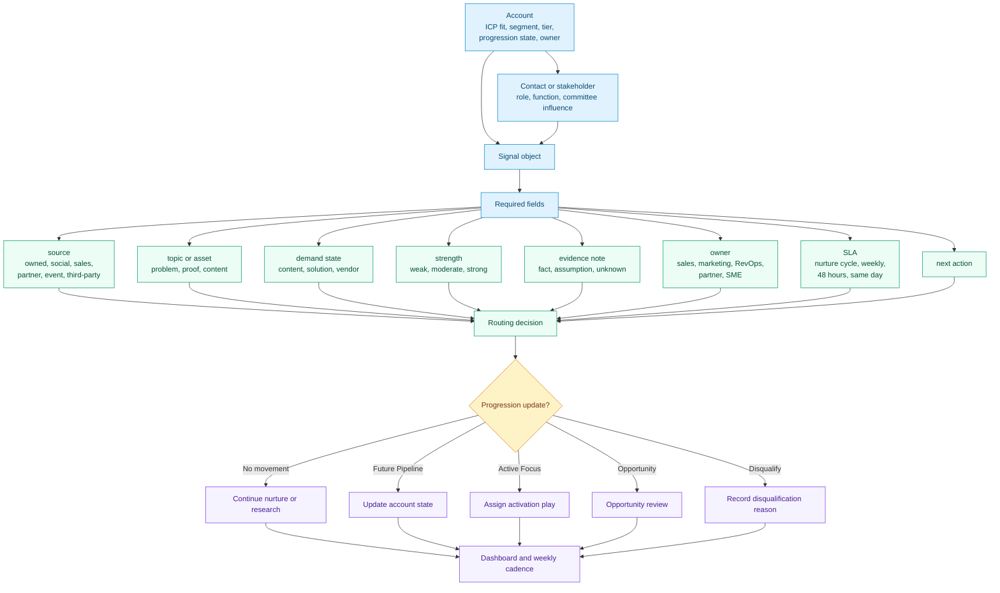

# 24: RevOps Signal Object And Data Model

Use this diagram to show the minimum data model required to operate signal routing.

```mermaid
flowchart TD
    ACCOUNT["Account<br/>ICP fit, segment, tier,<br/>progression state, owner"] --> CONTACT["Contact or stakeholder<br/>role, function, committee influence"]
    ACCOUNT --> SIGNAL["Signal object"]
    CONTACT --> SIGNAL

    SIGNAL --> FIELDS["Required fields"]
    FIELDS --> SOURCE["source<br/>owned, social, sales,<br/>partner, event, third-party"]
    FIELDS --> TOPIC["topic or asset<br/>problem, proof, content"]
    FIELDS --> STATE["demand state<br/>content, solution, vendor"]
    FIELDS --> STRENGTH["strength<br/>weak, moderate, strong"]
    FIELDS --> EVIDENCE["evidence note<br/>fact, assumption, unknown"]
    FIELDS --> OWNER["owner<br/>sales, marketing, RevOps,<br/>partner, SME"]
    FIELDS --> SLA["SLA<br/>nurture cycle, weekly,<br/>48 hours, same day"]
    FIELDS --> NEXT["next action"]

    SOURCE --> ROUTING["Routing decision"]
    TOPIC --> ROUTING
    STATE --> ROUTING
    STRENGTH --> ROUTING
    EVIDENCE --> ROUTING
    OWNER --> ROUTING
    SLA --> ROUTING
    NEXT --> ROUTING

    ROUTING --> PROGRESSION{"Progression update?"}
    PROGRESSION -->|No movement| NURTURE["Continue nurture or research"]
    PROGRESSION -->|Future Pipeline| FUTURE["Update account state"]
    PROGRESSION -->|Active Focus| ACTIVE["Assign activation play"]
    PROGRESSION -->|Opportunity| OPP["Opportunity review"]
    PROGRESSION -->|Disqualify| DISQ["Record disqualification reason"]

    NURTURE --> DASH["Dashboard and weekly cadence"]
    FUTURE --> DASH
    ACTIVE --> DASH
    OPP --> DASH
    DISQ --> DASH

    classDef object fill:#e0f2fe,color:#0c4a6e,stroke:#0284c7,stroke-width:1px;
    classDef field fill:#ecfdf5,color:#064e3b,stroke:#059669,stroke-width:1px;
    classDef decision fill:#fef3c7,color:#78350f,stroke:#d97706,stroke-width:1px;
    classDef output fill:#f5f3ff,color:#4c1d95,stroke:#7c3aed,stroke-width:1px;

    class ACCOUNT,CONTACT,SIGNAL,FIELDS object;
    class SOURCE,TOPIC,STATE,STRENGTH,EVIDENCE,OWNER,SLA,NEXT,ROUTING field;
    class PROGRESSION decision;
    class NURTURE,FUTURE,ACTIVE,OPP,DISQ,DASH output;
```
