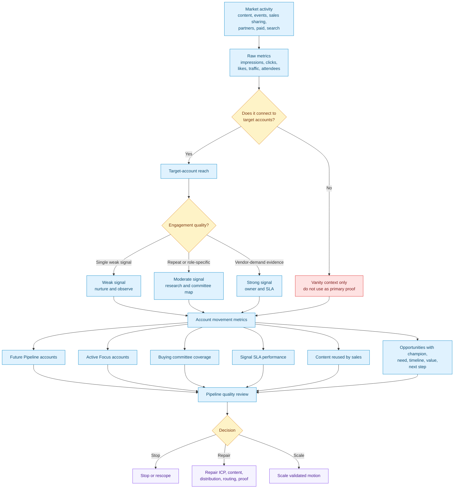

# 25: Metrics And Pipeline Quality

Use this diagram to separate useful leading indicators from vanity reporting.

```mermaid
flowchart TD
    ACTIVITY["Market activity<br/>content, events, sales sharing,<br/>partners, paid, search"] --> RAW["Raw metrics<br/>impressions, clicks,<br/>likes, traffic, attendees"]
    RAW --> CONTEXT{"Does it connect to<br/>target accounts?"}

    CONTEXT -->|No| VANITY["Vanity context only<br/>do not use as primary proof"]
    CONTEXT -->|Yes| ACCOUNT["Target-account reach"]

    ACCOUNT --> ENGAGE{"Engagement quality?"}
    ENGAGE -->|Single weak signal| WEAK["Weak signal<br/>nurture and observe"]
    ENGAGE -->|Repeat or role-specific| MOD["Moderate signal<br/>research and committee map"]
    ENGAGE -->|Vendor-demand evidence| STRONG["Strong signal<br/>owner and SLA"]

    WEAK --> MOVEMENT["Account movement metrics"]
    MOD --> MOVEMENT
    STRONG --> MOVEMENT
    VANITY --> MOVEMENT

    MOVEMENT --> FUTURE["Future Pipeline accounts"]
    MOVEMENT --> ACTIVE["Active Focus accounts"]
    MOVEMENT --> COMMITTEE["Buying committee coverage"]
    MOVEMENT --> SLA["Signal SLA performance"]
    MOVEMENT --> SALES_USE["Content reused by sales"]
    MOVEMENT --> OPP["Opportunities with champion,<br/>need, timeline, value,<br/>next step"]

    FUTURE --> QUALITY["Pipeline quality review"]
    ACTIVE --> QUALITY
    COMMITTEE --> QUALITY
    SLA --> QUALITY
    SALES_USE --> QUALITY
    OPP --> QUALITY

    QUALITY --> DECISION{"Decision"}
    DECISION -->|Stop| STOP["Stop or rescope"]
    DECISION -->|Repair| REPAIR["Repair ICP, content,<br/>distribution, routing, proof"]
    DECISION -->|Scale| SCALE["Scale validated motion"]

    classDef metric fill:#e0f2fe,color:#0c4a6e,stroke:#0284c7,stroke-width:1px;
    classDef decision fill:#fef3c7,color:#78350f,stroke:#d97706,stroke-width:1px;
    classDef warning fill:#fee2e2,color:#7f1d1d,stroke:#dc2626,stroke-width:1px;
    classDef output fill:#f5f3ff,color:#4c1d95,stroke:#7c3aed,stroke-width:1px;

    class ACTIVITY,RAW,ACCOUNT,WEAK,MOD,STRONG,MOVEMENT,FUTURE,ACTIVE,COMMITTEE,SLA,SALES_USE,OPP,QUALITY metric;
    class CONTEXT,ENGAGE,DECISION decision;
    class VANITY warning;
    class STOP,REPAIR,SCALE output;
```
