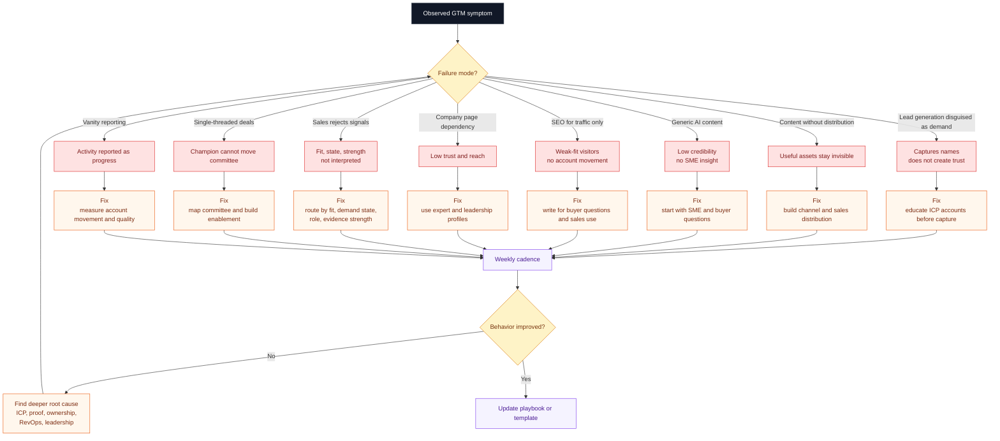

# 26: Anti-Pattern Correction System

Use this diagram when the demand system starts drifting into familiar failure modes.

```mermaid
flowchart TD
    SYMPTOM["Observed GTM symptom"] --> TYPE{"Failure mode?"}

    TYPE -->|Lead generation disguised as demand| LEAD["Captures names<br/>does not create trust"]
    TYPE -->|Content without distribution| NO_DIST["Useful assets stay invisible"]
    TYPE -->|Generic AI content| AI_BAD["Low credibility<br/>no SME insight"]
    TYPE -->|SEO for traffic only| SEO["Weak-fit visitors<br/>no account movement"]
    TYPE -->|Company page dependency| PAGE["Low trust and reach"]
    TYPE -->|Sales rejects signals| REJECT["Fit, state, strength<br/>not interpreted"]
    TYPE -->|Single-threaded deals| SINGLE["Champion cannot move committee"]
    TYPE -->|Vanity reporting| VANITY["Activity reported as progress"]

    LEAD --> FIX1["Fix<br/>educate ICP accounts before capture"]
    NO_DIST --> FIX2["Fix<br/>build channel and sales distribution"]
    AI_BAD --> FIX3["Fix<br/>start with SME and buyer questions"]
    SEO --> FIX4["Fix<br/>write for buyer questions and sales use"]
    PAGE --> FIX5["Fix<br/>use expert and leadership profiles"]
    REJECT --> FIX6["Fix<br/>route by fit, demand state,<br/>role, evidence strength"]
    SINGLE --> FIX7["Fix<br/>map committee and build enablement"]
    VANITY --> FIX8["Fix<br/>measure account movement and quality"]

    FIX1 --> CADENCE["Weekly cadence"]
    FIX2 --> CADENCE
    FIX3 --> CADENCE
    FIX4 --> CADENCE
    FIX5 --> CADENCE
    FIX6 --> CADENCE
    FIX7 --> CADENCE
    FIX8 --> CADENCE

    CADENCE --> VERIFY{"Behavior improved?"}
    VERIFY -->|No| ROOT["Find deeper root cause<br/>ICP, proof, ownership,<br/>RevOps, leadership"]
    VERIFY -->|Yes| STANDARD["Update playbook or template"]
    ROOT --> TYPE

    classDef symptom fill:#111827,color:#ffffff,stroke:#374151,stroke-width:1px;
    classDef decision fill:#fef3c7,color:#78350f,stroke:#d97706,stroke-width:1px;
    classDef bad fill:#fee2e2,color:#7f1d1d,stroke:#dc2626,stroke-width:1px;
    classDef fix fill:#fff7ed,color:#7c2d12,stroke:#ea580c,stroke-width:1px;
    classDef output fill:#f5f3ff,color:#4c1d95,stroke:#7c3aed,stroke-width:1px;

    class SYMPTOM symptom;
    class TYPE,VERIFY decision;
    class LEAD,NO_DIST,AI_BAD,SEO,PAGE,REJECT,SINGLE,VANITY bad;
    class FIX1,FIX2,FIX3,FIX4,FIX5,FIX6,FIX7,FIX8,ROOT fix;
    class CADENCE,STANDARD output;
```
