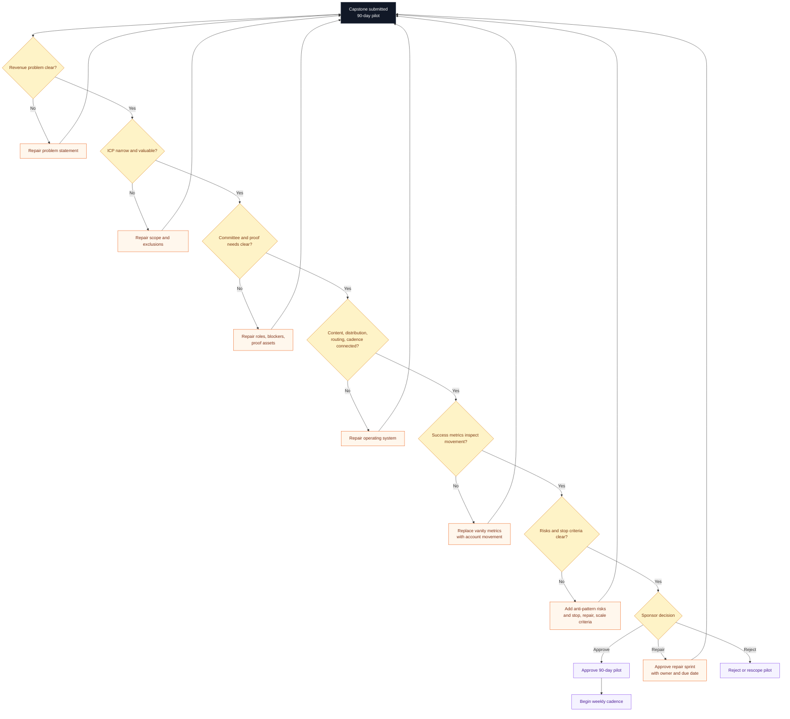

# 27: Executive Sponsor Decision Loop

Use this diagram to help leadership approve, repair, or reject a pilot with discipline.

```mermaid
flowchart TD
    SUBMIT["Capstone submitted<br/>90-day pilot"] --> PROBLEM{"Revenue problem clear?"}
    PROBLEM -->|No| REPAIR_PROBLEM["Repair problem statement"]
    PROBLEM -->|Yes| ICP{"ICP narrow and valuable?"}

    ICP -->|No| REPAIR_ICP["Repair scope and exclusions"]
    ICP -->|Yes| COMMITTEE{"Committee and proof needs clear?"}

    COMMITTEE -->|No| REPAIR_COMMITTEE["Repair roles, blockers,<br/>proof assets"]
    COMMITTEE -->|Yes| SYSTEM{"Content, distribution,<br/>routing, cadence connected?"}

    SYSTEM -->|No| REPAIR_SYSTEM["Repair operating system"]
    SYSTEM -->|Yes| METRICS{"Success metrics inspect movement?"}

    METRICS -->|No| REPAIR_METRICS["Replace vanity metrics<br/>with account movement"]
    METRICS -->|Yes| RISK{"Risks and stop criteria clear?"}

    RISK -->|No| REPAIR_RISK["Add anti-pattern risks<br/>and stop, repair, scale criteria"]
    RISK -->|Yes| DECIDE{"Sponsor decision"}

    DECIDE -->|Approve| APPROVE["Approve 90-day pilot"]
    DECIDE -->|Repair| REPAIR["Approve repair sprint<br/>with owner and due date"]
    DECIDE -->|Reject| REJECT["Reject or rescope pilot"]

    REPAIR_PROBLEM --> SUBMIT
    REPAIR_ICP --> SUBMIT
    REPAIR_COMMITTEE --> SUBMIT
    REPAIR_SYSTEM --> SUBMIT
    REPAIR_METRICS --> SUBMIT
    REPAIR_RISK --> SUBMIT
    REPAIR --> SUBMIT

    APPROVE --> CADENCE["Begin weekly cadence"]

    classDef input fill:#111827,color:#ffffff,stroke:#374151,stroke-width:1px;
    classDef decision fill:#fef3c7,color:#78350f,stroke:#d97706,stroke-width:1px;
    classDef repair fill:#fff7ed,color:#7c2d12,stroke:#ea580c,stroke-width:1px;
    classDef output fill:#f5f3ff,color:#4c1d95,stroke:#7c3aed,stroke-width:1px;

    class SUBMIT input;
    class PROBLEM,ICP,COMMITTEE,SYSTEM,METRICS,RISK,DECIDE decision;
    class REPAIR_PROBLEM,REPAIR_ICP,REPAIR_COMMITTEE,REPAIR_SYSTEM,REPAIR_METRICS,REPAIR_RISK,REPAIR repair;
    class APPROVE,REJECT,CADENCE output;
```
