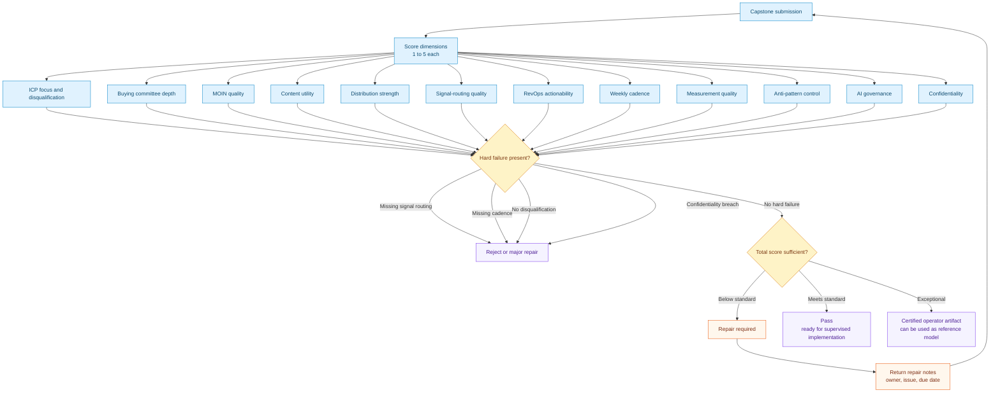

# 28: Capstone Scoring And Certification

Use this diagram to review Module 1 completion without lowering the standard.

```mermaid
flowchart TD
    SUBMIT["Capstone submission"] --> SCORE["Score dimensions<br/>1 to 5 each"]

    SCORE --> ICP["ICP focus and disqualification"]
    SCORE --> COMMITTEE["Buying committee depth"]
    SCORE --> MOIN["MOIN quality"]
    SCORE --> CONTENT["Content utility"]
    SCORE --> DIST["Distribution strength"]
    SCORE --> ROUTING["Signal-routing quality"]
    SCORE --> REVOPS["RevOps actionability"]
    SCORE --> CADENCE["Weekly cadence"]
    SCORE --> METRICS["Measurement quality"]
    SCORE --> RISKS["Anti-pattern control"]
    SCORE --> AI["AI governance"]
    SCORE --> CONF["Confidentiality"]

    ICP --> HARD{"Hard failure present?"}
    COMMITTEE --> HARD
    MOIN --> HARD
    CONTENT --> HARD
    DIST --> HARD
    ROUTING --> HARD
    REVOPS --> HARD
    CADENCE --> HARD
    METRICS --> HARD
    RISKS --> HARD
    AI --> HARD
    CONF --> HARD

    HARD -->|Missing signal routing| REJECT["Reject or major repair"]
    HARD -->|Missing cadence| REJECT
    HARD -->|No disqualification| REJECT
    HARD -->|Confidentiality breach| REJECT
    HARD -->|No hard failure| TOTAL{"Total score sufficient?"}

    TOTAL -->|Below standard| REPAIR["Repair required"]
    TOTAL -->|Meets standard| PASS["Pass<br/>ready for supervised implementation"]
    TOTAL -->|Exceptional| CERT["Certified operator artifact<br/>can be used as reference model"]

    REPAIR --> FEEDBACK["Return repair notes<br/>owner, issue, due date"]
    FEEDBACK --> SUBMIT

    classDef score fill:#e0f2fe,color:#0c4a6e,stroke:#0284c7,stroke-width:1px;
    classDef decision fill:#fef3c7,color:#78350f,stroke:#d97706,stroke-width:1px;
    classDef repair fill:#fff7ed,color:#7c2d12,stroke:#ea580c,stroke-width:1px;
    classDef output fill:#f5f3ff,color:#4c1d95,stroke:#7c3aed,stroke-width:1px;

    class SUBMIT,SCORE,ICP,COMMITTEE,MOIN,CONTENT,DIST,ROUTING,REVOPS,CADENCE,METRICS,RISKS,AI,CONF score;
    class HARD,TOTAL decision;
    class REPAIR,FEEDBACK repair;
    class REJECT,PASS,CERT output;
```
