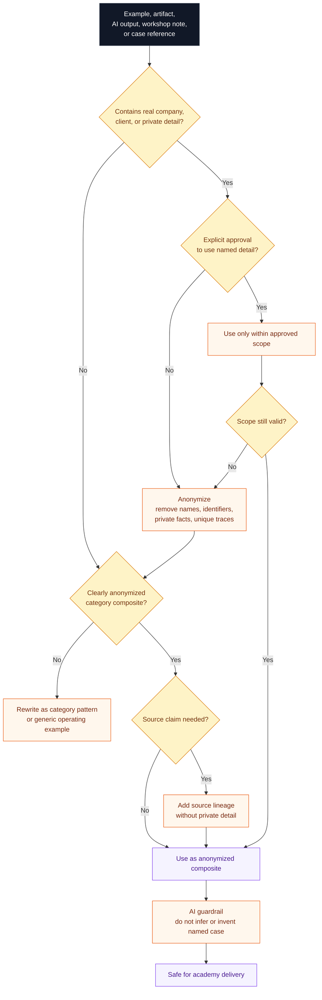

# 29: Confidentiality And Example Boundary

Use this diagram before publishing, exporting, or sharing any academy asset.

```mermaid
flowchart TD
    MATERIAL["Example, artifact,<br/>AI output, workshop note,<br/>or case reference"] --> CHECK{"Contains real company,<br/>client, or private detail?"}

    CHECK -->|No| COMPOSITE{"Clearly anonymized<br/>category composite?"}
    CHECK -->|Yes| PERMISSION{"Explicit approval<br/>to use named detail?"}

    PERMISSION -->|No| ANON["Anonymize<br/>remove names, identifiers,<br/>private facts, unique traces"]
    PERMISSION -->|Yes| APPROVED["Use only within approved scope"]

    ANON --> COMPOSITE
    COMPOSITE -->|No| REWRITE["Rewrite as category pattern<br/>or generic operating example"]
    COMPOSITE -->|Yes| SOURCE{"Source claim needed?"}

    SOURCE -->|No| USE["Use as anonymized composite"]
    SOURCE -->|Yes| TRACE["Add source lineage<br/>without private detail"]

    TRACE --> USE
    APPROVED --> SCOPE{"Scope still valid?"}
    SCOPE -->|No| ANON
    SCOPE -->|Yes| USE

    USE --> AI_GUARD["AI guardrail<br/>do not infer or invent named case"]
    AI_GUARD --> EXPORT["Safe for academy delivery"]

    classDef input fill:#111827,color:#ffffff,stroke:#374151,stroke-width:1px;
    classDef decision fill:#fef3c7,color:#78350f,stroke:#d97706,stroke-width:1px;
    classDef action fill:#fff7ed,color:#7c2d12,stroke:#ea580c,stroke-width:1px;
    classDef output fill:#f5f3ff,color:#4c1d95,stroke:#7c3aed,stroke-width:1px;

    class MATERIAL input;
    class CHECK,PERMISSION,COMPOSITE,SOURCE,SCOPE decision;
    class ANON,REWRITE,TRACE,APPROVED,AI_GUARD action;
    class USE,EXPORT output;
```
