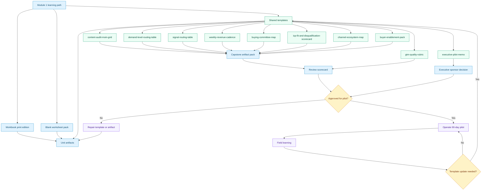

# 30: Template System Map

Use this diagram to show how templates support the module and the pilot.

```mermaid
flowchart TD
    MODULE["Module 1 learning path"] --> WORKBOOK["Workbook print edition"]
    MODULE --> TEMPLATE_PACK["Blank worksheet pack"]
    MODULE --> SHARED["Shared templates"]

    WORKBOOK --> UNIT_ARTIFACTS["Unit artifacts"]
    TEMPLATE_PACK --> UNIT_ARTIFACTS
    SHARED --> UNIT_ARTIFACTS

    SHARED --> MOIN["content-audit-moin-grid"]
    SHARED --> DEMAND["demand-level-routing-table"]
    SHARED --> SIGNAL["signal-routing-table"]
    SHARED --> CADENCE["weekly-revenue-cadence"]
    SHARED --> COMMITTEE["buying-committee-map"]
    SHARED --> ICP["icp-fit-and-disqualification-scorecard"]
    SHARED --> CHANNEL["channel-ecosystem-map"]
    SHARED --> ENABLE["buyer-enablement-pack"]
    SHARED --> RUBRIC["gtm-quality-rubric"]
    SHARED --> MEMO["executive-pilot-memo"]

    MOIN --> CAPSTONE["Capstone artifact pack"]
    DEMAND --> CAPSTONE
    SIGNAL --> CAPSTONE
    CADENCE --> CAPSTONE
    COMMITTEE --> CAPSTONE
    ICP --> CAPSTONE
    CHANNEL --> CAPSTONE
    ENABLE --> CAPSTONE
    RUBRIC --> REVIEW["Review scorecard"]
    MEMO --> EXEC["Executive sponsor decision"]

    CAPSTONE --> REVIEW
    REVIEW --> PILOT{"Approved for pilot?"}
    EXEC --> PILOT

    PILOT -->|No| REPAIR["Repair template or artifact"]
    PILOT -->|Yes| OPERATE["Operate 90-day pilot"]
    REPAIR --> UNIT_ARTIFACTS
    OPERATE --> FIELD["Field learning"]
    FIELD --> UPDATE{"Template update needed?"}
    UPDATE -->|Yes| SHARED
    UPDATE -->|No| OPERATE

    classDef asset fill:#e0f2fe,color:#0c4a6e,stroke:#0284c7,stroke-width:1px;
    classDef template fill:#ecfdf5,color:#064e3b,stroke:#059669,stroke-width:1px;
    classDef decision fill:#fef3c7,color:#78350f,stroke:#d97706,stroke-width:1px;
    classDef output fill:#f5f3ff,color:#4c1d95,stroke:#7c3aed,stroke-width:1px;

    class MODULE,WORKBOOK,TEMPLATE_PACK,UNIT_ARTIFACTS,CAPSTONE,REVIEW,EXEC asset;
    class SHARED,MOIN,DEMAND,SIGNAL,CADENCE,COMMITTEE,ICP,CHANNEL,ENABLE,RUBRIC,MEMO template;
    class PILOT,UPDATE decision;
    class REPAIR,OPERATE,FIELD output;
```
