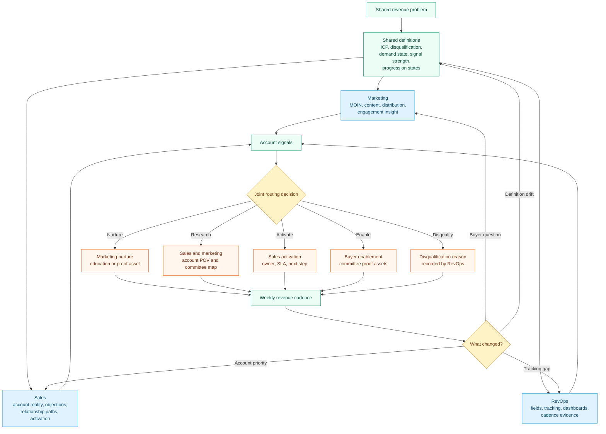

# 31: Sales, Marketing, And RevOps Alignment Loop

Use this diagram to show how the three operating teams keep the demand engine coordinated.

```mermaid
flowchart TD
    GOAL["Shared revenue problem"] --> DEFINITIONS["Shared definitions<br/>ICP, disqualification,<br/>demand state, signal strength,<br/>progression states"]

    DEFINITIONS --> MARKETING["Marketing<br/>MOIN, content, distribution,<br/>engagement insight"]
    DEFINITIONS --> SALES["Sales<br/>account reality, objections,<br/>relationship paths, activation"]
    DEFINITIONS --> REVOPS["RevOps<br/>fields, tracking, dashboards,<br/>cadence evidence"]

    MARKETING --> SIGNALS["Account signals"]
    SALES --> SIGNALS
    REVOPS --> SIGNALS

    SIGNALS --> ROUTING{"Joint routing decision"}
    ROUTING -->|Nurture| MKT_ACTION["Marketing nurture<br/>education or proof asset"]
    ROUTING -->|Research| SALES_RESEARCH["Sales and marketing<br/>account POV and committee map"]
    ROUTING -->|Activate| SALES_ACTION["Sales activation<br/>owner, SLA, next step"]
    ROUTING -->|Enable| ENABLE["Buyer enablement<br/>committee proof assets"]
    ROUTING -->|Disqualify| DISQ["Disqualification reason<br/>recorded by RevOps"]

    MKT_ACTION --> CADENCE["Weekly revenue cadence"]
    SALES_RESEARCH --> CADENCE
    SALES_ACTION --> CADENCE
    ENABLE --> CADENCE
    DISQ --> CADENCE

    CADENCE --> LEARN{"What changed?"}
    LEARN -->|Buyer question| MARKETING
    LEARN -->|Account priority| SALES
    LEARN -->|Tracking gap| REVOPS
    LEARN -->|Definition drift| DEFINITIONS

    classDef team fill:#e0f2fe,color:#0c4a6e,stroke:#0284c7,stroke-width:1px;
    classDef shared fill:#ecfdf5,color:#064e3b,stroke:#059669,stroke-width:1px;
    classDef decision fill:#fef3c7,color:#78350f,stroke:#d97706,stroke-width:1px;
    classDef action fill:#fff7ed,color:#7c2d12,stroke:#ea580c,stroke-width:1px;

    class GOAL,DEFINITIONS,SIGNALS,CADENCE shared;
    class MARKETING,SALES,REVOPS team;
    class ROUTING,LEARN decision;
    class MKT_ACTION,SALES_RESEARCH,SALES_ACTION,ENABLE,DISQ action;
```
