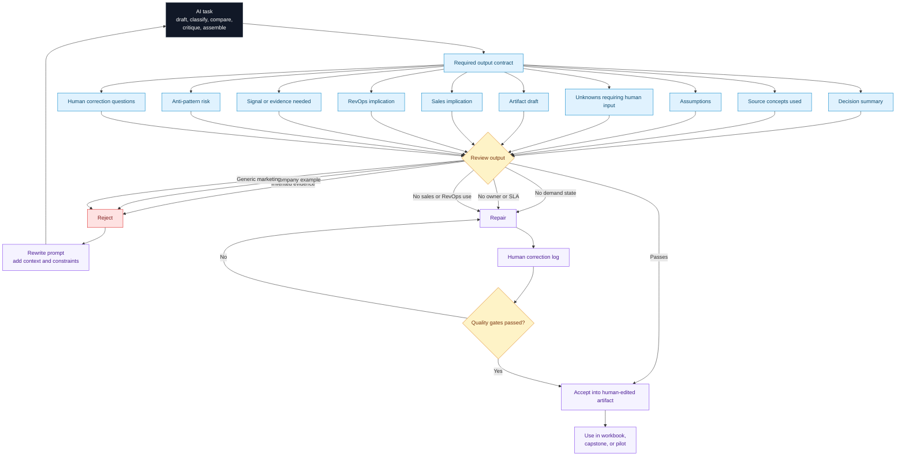

# 32: AI Output Contract And Rejection Rules

Use this diagram to evaluate any AI-generated Module 1 work.

```mermaid
flowchart TD
    TASK["AI task<br/>draft, classify, compare,<br/>critique, assemble"] --> CONTRACT["Required output contract"]

    CONTRACT --> SUMMARY["Decision summary"]
    CONTRACT --> SOURCE["Source concepts used"]
    CONTRACT --> ASSUME["Assumptions"]
    CONTRACT --> UNKNOWNS["Unknowns requiring human input"]
    CONTRACT --> ARTIFACT["Artifact draft"]
    CONTRACT --> SALES["Sales implication"]
    CONTRACT --> REVOPS["RevOps implication"]
    CONTRACT --> SIGNAL["Signal or evidence needed"]
    CONTRACT --> RISK["Anti-pattern risk"]
    CONTRACT --> QUESTIONS["Human correction questions"]

    SUMMARY --> REVIEW{"Review output"}
    SOURCE --> REVIEW
    ASSUME --> REVIEW
    UNKNOWNS --> REVIEW
    ARTIFACT --> REVIEW
    SALES --> REVIEW
    REVOPS --> REVIEW
    SIGNAL --> REVIEW
    RISK --> REVIEW
    QUESTIONS --> REVIEW

    REVIEW -->|Invented evidence| REJECT["Reject"]
    REVIEW -->|Named-company example| REJECT
    REVIEW -->|Generic marketing| REJECT
    REVIEW -->|No demand state| REPAIR["Repair"]
    REVIEW -->|No owner or SLA| REPAIR
    REVIEW -->|No sales or RevOps use| REPAIR
    REVIEW -->|Passes| ACCEPT["Accept into human-edited artifact"]

    REJECT --> REPROMPT["Rewrite prompt<br/>add context and constraints"]
    REPAIR --> HUMAN["Human correction log"]
    REPROMPT --> TASK
    HUMAN --> QUALITY{"Quality gates passed?"}
    QUALITY -->|No| REPAIR
    QUALITY -->|Yes| ACCEPT
    ACCEPT --> USE["Use in workbook,<br/>capstone, or pilot"]

    classDef input fill:#111827,color:#ffffff,stroke:#374151,stroke-width:1px;
    classDef contract fill:#e0f2fe,color:#0c4a6e,stroke:#0284c7,stroke-width:1px;
    classDef decision fill:#fef3c7,color:#78350f,stroke:#d97706,stroke-width:1px;
    classDef warning fill:#fee2e2,color:#7f1d1d,stroke:#dc2626,stroke-width:1px;
    classDef output fill:#f5f3ff,color:#4c1d95,stroke:#7c3aed,stroke-width:1px;

    class TASK input;
    class CONTRACT,SUMMARY,SOURCE,ASSUME,UNKNOWNS,ARTIFACT,SALES,REVOPS,SIGNAL,RISK,QUESTIONS contract;
    class REVIEW,QUALITY decision;
    class REJECT warning;
    class REPAIR,REPROMPT,HUMAN,ACCEPT,USE output;
```
