# Master Industrial Demand Generation Operating System

Use this master flowchart to explain the full Module 1 process as one operating system.

The diagram shows how industrial demand generation moves from market focus to buyer intelligence, content and proof, trusted distribution, signal capture, routing, buyer enablement, pipeline quality, cadence, and sponsor decision.

## How to Read This Flowchart

Read the flow from top to bottom.

The main operating spine follows Stage 1 through Stage 7 in sequence. Repair loops are shown as local corrections inside the relevant stage. The final learning loop is represented as an output that feeds the next operating cycle, so the visual order remains fixed from Stage 1 to Stage 7.

Each color represents one operating stage.

| Stage | Color Role | Operating Meaning |
|---|---|---|
| Strategic Focus | Green | Decide Where Demand Matters and What to Exclude |
| Buyer Intelligence | Blue | Map the Committee, Proof Needs, and MOIN |
| Content and Proof Engine | Teal | Turn Buyer Questions into Useful Proof Assets |
| Trusted Distribution | Orange | Move Insight through Trusted Industrial Paths |
| Signal Capture | Gold | Convert Activity into Account-Level Evidence |
| Routing and Buyer Enablement | Rust | Choose the Right Next Action by Fit, State, Role, and Strength |
| Cadence and Governance | Purple | Review Movement, Repair the System, and Decide Whether to Stop, Repair, or Scale |

Icon labels use Mermaid Font Awesome syntax. If a renderer does not support Font Awesome icons, the diagram should remain readable from the node text alone.

## Master Mermaid Flowchart

```mermaid
flowchart TD
    START["fa:fa-chart-line Revenue Problem<br/>Pipeline, Account Movement, Qualified Opportunities"]

    subgraph S1["1. Strategic Focus"]
        direction TB
        FOCUS["fa:fa-bullseye Market Focus<br/>Category, Geography, Trigger, Exclusions"]
        ICP["fa:fa-crosshairs ICP Focus<br/>Fit, Segment, Access Path"]
        DISQ{"fa:fa-filter Disqualification Rules<br/>Clear Enough?"}
        REPAIR_FOCUS["fa:fa-wrench Repair Focus<br/>Segment, Trigger, Exclusions"]
    end

    subgraph S2["2. Buyer Intelligence"]
        direction TB
        COMMITTEE["fa:fa-users Buying Committee Map<br/>Champion, Technical, Operations, Finance, Procurement"]
        PROOF_NEEDS["fa:fa-shield-halved Role-Specific Proof Needs<br/>Beliefs, Fears, Blockers, Required Proof"]
        MOIN["fa:fa-map MOIN Grid<br/>Questions by Role and Demand State"]
    end

    subgraph S3["3. Content and Proof Engine"]
        direction TB
        QUESTION_PROOF["fa:fa-link Question-to-Proof Pipeline<br/>Question, Risk, Proof, Asset, Signal"]
        ASSETS["fa:fa-file-lines First-Five Asset Plan<br/>Problem, Criteria, Proof, Champion Pack, Validation"]
        QUALITY{"fa:fa-circle-check Proof and Sales Use<br/>Ready?"}
        REPAIR_CONTENT["fa:fa-hammer Repair Asset<br/>Proof, SME Input, Sales Use"]
    end

    subgraph S4["4. Trusted Distribution"]
        direction TB
        DISTRIBUTION["fa:fa-share-nodes Trusted Distribution Plan<br/>Asset, Channel, Owner, Cadence"]
        CHANNELS["fa:fa-network-wired Trust Paths<br/>Sales, SME, Event, Partner, Association, Owned, Search"]
        CAPTURE_CHECK{"fa:fa-clipboard-check Account Evidence<br/>Captured?"}
        CAPTURE_REPAIR["fa:fa-gears Fix Capture<br/>Source, Role, Topic, Account, Owner"]
    end

    subgraph S5["5. Signal Capture"]
        direction TB
        SIGNAL_OBJECT["fa:fa-database RevOps Signal Object<br/>Account, Role, State, Source, Strength"]
        ROUTE{"fa:fa-route Route by Fit, State,<br/>Role, and Strength"}
    end

    subgraph S6["6. Routing and Buyer Enablement"]
        direction TB
        EDUCATE["fa:fa-book-open Educate and Nurture<br/>Content Demand"]
        RESEARCH["fa:fa-magnifying-glass-chart Research Account<br/>Solution Demand"]
        ACTIVATE["fa:fa-handshake Activate Sales<br/>Vendor Demand"]
        DOWNGRADE["fa:fa-ban Downgrade or Reject<br/>Low Fit or Weak Evidence"]
        ENABLE["fa:fa-people-arrows Buyer Enablement<br/>Proof for Internal Consensus"]
        PIPELINE["fa:fa-chart-simple Qualified Pipeline Review<br/>Champion, Need, Value, Next Step"]
        ROUTING_OUTPUT["fa:fa-clipboard-list Routed Action Record<br/>Owner, SLA, Evidence, Next Step"]
    end

    subgraph S7["7. Cadence and Governance"]
        direction TB
        CADENCE["fa:fa-calendar-check Weekly Revenue Cadence<br/>Movement, Signals, Proof Gaps, Commitments"]
        PILOT["fa:fa-rocket 90-Day Pilot Evidence<br/>Learning Quality Before Scale"]
        DECISION{"fa:fa-scale-balanced Sponsor Decision<br/>Stop, Repair, or Scale?"}
        STOP["fa:fa-circle-xmark Stop or Rescope<br/>Weak Fit, Proof, Access, or Cadence"]
        SYSTEM_REPAIR["fa:fa-screwdriver-wrench Repair System<br/>ICP, MOIN, Content, Distribution, Routing, RevOps"]
        LEARNING["fa:fa-rotate Learning Loop<br/>Feed Next Operating Cycle"]
        NEXT_CYCLE["fa:fa-arrow-up-long Return Inputs<br/>Focus, ICP, MOIN, Content, Distribution, Routing"]
        SCALE["fa:fa-arrow-trend-up Scale Operating Motion<br/>Account Movement and Quality Pipeline"]
    end

    START --> FOCUS
    FOCUS --> ICP
    ICP --> DISQ
    DISQ -->|No: Repair Focus| REPAIR_FOCUS
    REPAIR_FOCUS --> FOCUS
    DISQ -->|Ready| COMMITTEE

    COMMITTEE --> PROOF_NEEDS
    PROOF_NEEDS --> MOIN
    MOIN --> QUESTION_PROOF

    QUESTION_PROOF --> ASSETS
    ASSETS --> QUALITY
    QUALITY -->|No: Repair Proof| REPAIR_CONTENT
    REPAIR_CONTENT --> QUESTION_PROOF
    QUALITY -->|Ready| DISTRIBUTION

    DISTRIBUTION --> CHANNELS
    CHANNELS --> CAPTURE_CHECK
    CAPTURE_CHECK -->|No: Fix Capture| CAPTURE_REPAIR
    CAPTURE_REPAIR --> DISTRIBUTION
    CAPTURE_CHECK -->|Captured| SIGNAL_OBJECT

    SIGNAL_OBJECT --> ROUTE
    ROUTE -->|Content Demand| EDUCATE
    ROUTE -->|Solution Demand| RESEARCH
    ROUTE -->|Vendor Demand| ACTIVATE
    ROUTE -->|Low Fit or Weak Evidence| DOWNGRADE

    RESEARCH --> ENABLE
    ACTIVATE --> ENABLE
    ENABLE --> PIPELINE
    EDUCATE --> ROUTING_OUTPUT
    DOWNGRADE --> ROUTING_OUTPUT
    PIPELINE --> ROUTING_OUTPUT
    ROUTING_OUTPUT --> CADENCE

    CADENCE --> PILOT
    PILOT --> DECISION
    DECISION -->|Stop| STOP
    DECISION -->|Repair| SYSTEM_REPAIR
    DECISION -->|Scale| SCALE
    SYSTEM_REPAIR --> LEARNING
    LEARNING --> NEXT_CYCLE

    classDef start fill:#111827,color:#ffffff,stroke:#374151,stroke-width:1px;
    classDef strategy fill:#ecfdf5,color:#064e3b,stroke:#059669,stroke-width:1px;
    classDef buyer fill:#e0f2fe,color:#0c4a6e,stroke:#0284c7,stroke-width:1px;
    classDef content fill:#ccfbf1,color:#134e4a,stroke:#0f766e,stroke-width:1px;
    classDef distribution fill:#fff7ed,color:#7c2d12,stroke:#ea580c,stroke-width:1px;
    classDef signal fill:#fef3c7,color:#78350f,stroke:#d97706,stroke-width:1px;
    classDef routing fill:#fee2e2,color:#7f1d1d,stroke:#dc2626,stroke-width:1px;
    classDef governance fill:#f5f3ff,color:#4c1d95,stroke:#7c3aed,stroke-width:1px;
    classDef decision fill:#fefce8,color:#713f12,stroke:#ca8a04,stroke-width:2px;

    class START start;
    class FOCUS,ICP,REPAIR_FOCUS strategy;
    class COMMITTEE,PROOF_NEEDS,MOIN buyer;
    class QUESTION_PROOF,ASSETS,REPAIR_CONTENT content;
    class DISTRIBUTION,CHANNELS,CAPTURE_REPAIR distribution;
    class SIGNAL_OBJECT signal;
    class EDUCATE,RESEARCH,ACTIVATE,DOWNGRADE,ENABLE,PIPELINE,ROUTING_OUTPUT routing;
    class CADENCE,PILOT,STOP,SYSTEM_REPAIR,LEARNING,NEXT_CYCLE,SCALE governance;
    class DISQ,QUALITY,CAPTURE_CHECK,ROUTE,DECISION decision;

    style S1 fill:#f0fdf4,stroke:#059669,stroke-width:1px,color:#064e3b
    style S2 fill:#f0f9ff,stroke:#0284c7,stroke-width:1px,color:#0c4a6e
    style S3 fill:#f0fdfa,stroke:#0f766e,stroke-width:1px,color:#134e4a
    style S4 fill:#fff7ed,stroke:#ea580c,stroke-width:1px,color:#7c2d12
    style S5 fill:#fefce8,stroke:#d97706,stroke-width:1px,color:#78350f
    style S6 fill:#fff1f2,stroke:#dc2626,stroke-width:1px,color:#7f1d1d
    style S7 fill:#faf5ff,stroke:#7c3aed,stroke-width:1px,color:#4c1d95
```

## Operating Logic

| Step | Operating Question | Required Output |
|---|---|---|
| Strategic Focus | Where should demand generation concentrate for the next 90 days? | ICP Focus and Disqualification Rules |
| Buyer Intelligence | Who must believe what before the account can move? | Buying Committee Map and MOIN Grid |
| Content and Proof Engine | What questions must be answered with credible proof? | First-Five Asset Plan |
| Trusted Distribution | How will useful insight reach the right roles through trusted paths? | Distribution Plan with Owners and Cadence |
| Signal Capture | What evidence proves account movement rather than activity volume? | RevOps Signal Object |
| Routing and Buyer Enablement | What should happen next based on fit, demand state, role, and strength? | Routed Action and Buyer Enablement Asset |
| Cadence and Governance | What did the system learn, and should leadership stop, repair, or scale? | 90-Day Pilot Decision |

## Decision Rules

- Do not route weak-fit activity as priority demand.
- Do not treat content demand as vendor demand.
- Do not create assets without proof, sales use, distribution path, and signal expectation.
- Do not scale distribution until account evidence is captured by role, source, topic, and strength.
- Do not use vanity metrics as primary proof.
- Do not approve the pilot without cadence ownership and stop, repair, scale criteria.

## Quality Gates

| Quality Gate | Pass Standard |
|---|---|
| ICP Gate | Focus is narrow, triggered, reachable, and explicitly excludes weak-fit demand |
| Buyer Gate | Committee roles, fears, proof needs, and blockers are visible |
| MOIN Gate | Buyer questions are mapped by role and demand state |
| Content Gate | Assets answer real buyer questions and carry credible proof |
| Distribution Gate | Channels are selected by trust path, not publishing convenience |
| Signal Gate | Signals include account, role, demand state, source, strength, owner, SLA, and next action |
| Cadence Gate | Weekly review creates decisions, commitments, and system repairs |
| Sponsor Gate | Leadership can stop, repair, or scale from evidence |

## Source Lineage

| Source | Coverage |
|---|---|
| Module 1 Source Commit | `9e28222` |
| Lesson 01 | Industrial Demand Generation Foundations |
| Lesson 02 | Industrial Buyer Reality |
| Lesson 03 | ICP, Segments, and Demand Focus |
| Lesson 04 | MOIN: Map of Informational Needs |
| Lesson 05 | Content Engine for Industrial Demand |
| Lesson 06 | Distribution: The Missing Half |
| Lesson 07 | Signal Routing and Demand Capture |
| Lesson 08 | Measurement, Cadence, and 90-Day Pilot |
