# Unit 1: Industrial Demand Generation Foundations

## Operator Promise

By the end of this unit, the learner can diagnose whether an industrial company has a real demand generation engine or only scattered marketing activity, lead capture, and sales heroics.

The output is a demand system diagnostic with three priority repairs:

1. one focus repair;
2. one content or distribution repair;
3. one signal, owner, or cadence repair.

## Source Anchors

- `master-intelligence/02-industrial-gtm-operating-system.md`
- `master-intelligence/03-demand-generation-and-content-engine.md`
- `master-intelligence/05-sales-marketing-alignment-and-revenue-cadence.md`
- `master-intelligence/10-signal-and-demand-routing-system.md`
- `master-intelligence/14-anti-patterns-and-red-flags.md`
- `templates/demand-level-routing-table.md`
- `templates/signal-routing-table.md`
- `templates/weekly-revenue-cadence.md`

## Concept

Industrial demand generation is the operating system that helps the right accounts become educated, trust the supplier, involve the buying committee, and move toward qualified pipeline.

It is not the same as lead generation.

Lead generation asks, "How do we collect more names?"

Industrial demand generation asks:

- Which market do we want to move?
- What do buyers not yet understand?
- Which buying committee roles must believe this is worth attention?
- What proof reduces risk?
- Where does trust actually travel in this sector?
- What signals show account movement?
- When should sales act, wait, research, enable, or disqualify?
- What should RevOps inspect every week?

In industrial markets, demand often exists before it is visible. A plant has a quality issue, an audit risk, a throughput bottleneck, an energy cost problem, a maintenance concern, a vendor failure, or an expansion plan. The buyer may not search for the vendor yet. The buyer may ask a consultant, attend an exhibition, discuss with a distributor, compare old suppliers, or ask a technical peer. Demand generation must create the education and trust that makes the future buying conversation easier.

## The Industrial Demand Generation Engine

```mermaid
flowchart LR
    A["Revenue goal"] --> B["Market focus"]
    B --> C["ICP and buying committee"]
    C --> D["Buyer questions and MOIN"]
    D --> E["Content and proof assets"]
    E --> F["Trusted distribution"]
    F --> G["Account-level signals"]
    G --> H["Signal routing"]
    H --> I["Buyer enablement"]
    I --> J["Qualified pipeline"]
    J --> K["Weekly learning loop"]
    K --> B
```

The engine has seven practical jobs in Module 1:

| Job | Operating Question | Failure Pattern |
|---|---|---|
| Focus the market | Where are we trying to create movement? | broad TAM language and unfocused content |
| Understand the committee | Who must believe what? | one-person persona thinking |
| Map informational needs | What questions block movement? | topic brainstorms and brochure logic |
| Build content and proof | What asset reduces uncertainty? | generic blogs or product claims |
| Distribute through trust | Where will buyers actually see and trust this? | publishing without circulation |
| Route signals | What does this evidence mean? | treating engagement as buying intent |
| Inspect weekly | What changed and what do we do next? | dashboards that report activity, not movement |

## Why This Matters In Industrial Markets

Industrial buyers do not behave like generic software buyers.

They often face:

- high switching cost;
- plant disruption risk;
- procurement process constraints;
- quality, validation, compliance, or safety requirements;
- distributor or consultant influence;
- technical proof requirements;
- multiple internal stakeholders;
- long periods of invisible evaluation;
- low tolerance for exaggerated claims.

That means demand generation cannot be a campaign calendar. It must be a trust-building and risk-reduction system. The work is not "post content until someone fills a form." The work is to educate the market, equip the buying committee, create observable account signals, and help sales act only when evidence justifies action.

## Demand Creation, Distribution, Capture, And Enablement

Industrial demand generation has four linked motions.

| Motion | Purpose | Industrial Example | Common Mistake |
|---|---|---|---|
| Demand creation | make buyers understand a problem or opportunity | explaining hidden defect cost before an inspection project is active | pitching the product before the problem is believed |
| Distribution | make insight visible through trusted channels | expert profile, association webinar, distributor note, event follow-up | posting only on the company blog |
| Demand capture | identify account-level evidence and route it | repeated role-specific engagement, consultation request, RFQ, event conversation | treating every click as an MQL |
| Buyer enablement | help internal champions move the committee | business case, validation proof, TCO, procurement pack | giving the seller a better deck but not helping the buyer buy |

If any one motion is missing, the engine breaks. Education without distribution stays invisible. Distribution without signal routing creates noise. Capture without buyer enablement creates stalled opportunities. Cadence without clear definitions becomes reporting theater.

## Demand States

The first foundational discipline is separating three kinds of demand.

| Demand State | Buyer Mindset | Industrial Translation | Right Action | Wrong Action |
|---|---|---|---|---|
| Content demand | I need to understand this issue | buyer reads about compliance, defects, process loss, reliability, cost, or risk | educate, build trust, watch account pattern | sales pitch |
| Solution demand | We may need a way to solve this | buyer compares methods, specifications, operating models, validation approaches | provide frameworks, proof, comparison, committee education | force vendor meeting too early |
| Vendor demand | We need the right supplier | buyer asks for RFQ, audit, sample, consultation, spec review, demo, validation, site visit | activate sales and enable committee | leave in generic nurture |

Demand generation maturity begins when the team stops collapsing all three states into "lead."

## Industrial Example

A composite food processing equipment supplier receives many RFQs from price-sensitive buyers. The team attends exhibitions, collects visiting cards, posts product images, and celebrates inquiry volume. Sales complains that most inquiries are low quality.

The hidden problem is not sales follow-up. The problem is that the company has no demand generation engine.

What is happening:

- the revenue goal is vague: "get more inquiries";
- the market focus is broad: all snack and food processors;
- content is mostly brochures and exhibition photos;
- distribution depends on events and the company page;
- signals are not classified by fit, role, demand state, or strength;
- sales receives weak leads without context;
- RevOps cannot inspect target account movement;
- buyers do not get enough education before asking for price.

The demand generation repair is to move upstream and create account movement before RFQs appear.

| Repair Layer | Better Operating Move |
|---|---|
| Revenue goal | build qualified pipeline from export-oriented snack manufacturers expanding automated frying capacity |
| Market focus | prioritize plants with throughput, oil efficiency, hygiene, or export quality triggers |
| Buyer education | teach oil life, energy use, throughput consistency, hygiene risk, startup-to-scale planning |
| Distribution | use expert LinkedIn, sales sharing, distributor education, trade-show prework, association sessions |
| Signal routing | classify repeat engagement by role and account fit before asking sales to act |
| Buyer enablement | create TCO note, implementation plan, quality checklist, and owner-level business case |
| Cadence | review target account progression, not inquiry volume alone |

## Diagnostic Question

Where is the current system confusing activity with account movement?

Use these prompts to diagnose:

- Are we measuring the number of leads, or the movement of high-fit accounts?
- Do we know which buying committee roles are engaging?
- Can sales explain why an account should be acted on now?
- Do we have content for content demand, solution demand, and vendor demand?
- Does distribution happen through trusted channels, or only owned publishing?
- Does RevOps capture signal source, state, strength, owner, SLA, and next action?
- What accounts moved from unknown to Future Pipeline or Active Focus?
- What did we learn this week that changes ICP, content, distribution, or sales action?

## Individual Exercise

Complete the demand system diagnostic for one selected manufacturing or export category.

| Layer | Current Evidence | Gap | Repair Action |
|---|---|---|---|
| Revenue goal |  |  |  |
| Market focus |  |  |  |
| ICP and buying committee |  |  |  |
| Demand creation |  |  |  |
| Distribution |  |  |  |
| Account intelligence |  |  |  |
| Activation |  |  |  |
| Buyer enablement |  |  |  |
| Revenue cadence |  |  |  |

Then classify the current motion:

| Question | Answer |
|---|---|
| Are we creating demand, capturing existing demand, or collecting leads? |  |
| What account movement do we want in 90 days? |  |
| What buying committee roles must move? |  |
| What content or proof is missing? |  |
| What signal would show movement? |  |
| What should sales do differently? |  |
| What should RevOps track? |  |

## Group Critique

Each learner presents one weakness in the current system. The group must decide:

- Is this a focus problem, content problem, distribution problem, routing problem, enablement problem, or cadence problem?
- What is the real commercial consequence?
- Which buying committee role is affected?
- What would sales need to act intelligently?
- What would RevOps need to capture?
- What would make the proposed repair fail in an industrial company?

The facilitator should reject any answer that stops at "make more content," "run more ads," or "get more leads."

## AI-Assisted Attempt

Use AI to classify the current demand motion. Give the AI the selected category, current assets, current channels, current sales feedback, and current CRM fields.

Required AI output:

| Output | Required Standard |
|---|---|
| System diagnosis | classify as demand creation, demand capture, lead collection, or mixed system |
| Missing layer | identify the weakest operating-system layer |
| Likely anti-pattern | name the anti-pattern and explain the commercial risk |
| Repair recommendation | give one practical repair that can be started within two weeks |
| Signal to track | define the account-level signal, owner, and cadence |
| Human questions | list unknowns that require sales, RevOps, SME, or leadership input |

## Human Correction

Humans must repair AI output when it:

- recommends more content without distribution;
- recommends lead magnets before buyer trust exists;
- treats impressions, traffic, likes, or MQLs as primary success;
- ignores sales actionability;
- ignores RevOps fields and weekly inspection;
- assumes a short, single-person buying journey;
- recommends activation before demand state and signal strength are known;
- invents a named-company example.

## RevOps Translation

The diagnostic must translate into visible fields or working columns.

At minimum, RevOps needs:

| Field Or Object | Purpose |
|---|---|
| Account fit | high, medium, low, disqualified |
| Demand state | content, solution, vendor |
| Signal source | first-party, third-party, ecosystem, sales-discovered |
| Signal strength | weak, moderate, strong |
| Buying role | production, quality, engineering, procurement, finance, leadership, consultant, distributor |
| Progression state | Cluster ICP, Future Pipeline, Active Focus, Opportunity, Disqualified |
| Owner | sales, marketing, RevOps, partner, SME, leadership |
| SLA | action timing by signal type |
| Next action | nurture, research, map committee, enable, activate, opportunity review, disqualify |

If these cannot be tracked in CRM yet, use a temporary spreadsheet. But the team must not pretend the system is operational if evidence lives only in meeting notes and memory.

## Failure Modes

| Failure Mode | What It Looks Like | Correction |
|---|---|---|
| Lead-gen disguise | forms and MQLs dominate discussion | reset around account movement and demand states |
| Campaign calendar thinking | content is planned by month, not buyer uncertainty | rebuild around MOIN and sales use |
| Owned-channel dependency | posts are published but not circulated | build expert, sales, partner, association, event, and paid distribution |
| Sales heroics | sales receives names without context | route by fit, role, demand state, and evidence strength |
| RevOps invisibility | no signal object or progression state | define fields and weekly cadence board |
| Premature scale | leadership wants more channels before proof | run a 90-day pilot with stop, repair, scale criteria |

## Final Artifact

Submit a demand system diagnostic with:

- one category or segment focus;
- current-state diagnosis across the nine layers;
- three priority repairs;
- one account movement signal;
- one RevOps tracking requirement;
- one sales behavior change;
- one anti-pattern risk.

## Completion Standard

This unit is complete only when a sales leader, marketing leader, and RevOps owner can all answer:

- which accounts matter;
- what movement matters;
- what evidence proves movement;
- what sales should do next;
- what content or proof must exist;
- what RevOps must track weekly.

If the output could be used unchanged by a generic SaaS company, it fails.

## Integrative Questions

- How does this affect sales?
- What signal would prove this is working?
- What would RevOps need to track?
- What content would help the buyer move forward?
- What would an AI agent likely get wrong here?
- What would make this fail in an industrial company?
