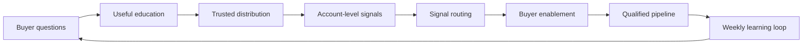

# Unit 1: Industrial Demand Generation Foundations

## Concept

Industrial demand generation is a trust and account-movement system, not a lead collection function.

The core sequence is:

The point is not to maximize campaign volume. The point is to help the right industrial buyers understand operational problems, evaluate approaches, reduce buying risk, and move through a committee-led buying process.

## Industrial Example

An export-oriented food processing equipment supplier is receiving low-quality RFQs from price-sensitive buyers. The company has brochures and exhibition traffic, but few account-level signals before buyers ask for pricing.

The demand generation correction is to move upstream:

- teach oil efficiency, hygiene, throughput, and startup-to-scale planning;
- distribute insight through expert profiles, event follow-up, distributors, and technical content;
- track which target accounts engage with which operational problem;
- route strong signals to sales only when fit, role, and demand state justify action.

## Diagnostic Question

Where is the current system confusing activity with account movement?

## Individual Exercise

Complete the demand system diagnostic:

| Layer | Current Evidence | Gap | Repair Action |
|---|---|---|---|
| Revenue goal |  |  |  |
| Market focus |  |  |  |
| ICP and buying committee |  |  |  |
| Demand creation |  |  |  |
| Distribution |  |  |  |
| Account intelligence |  |  |  |
| Activation |  |  |  |
| Buyer enablement |  |  |  |
| Revenue cadence |  |  |  |

## Group Critique

Each learner presents one gap. The group must answer:

- Is this a demand creation problem, demand capture problem, distribution problem, signal-routing problem, or sales alignment problem?
- What account movement would prove improvement?
- What would RevOps need to track?

## AI-Assisted Attempt

Ask the AI agent to classify the current demand motion.

Required AI output:

- demand creation, capture, or lead-collection diagnosis;
- missing operating-system layer;
- likely anti-pattern;
- one repair action;
- one signal to track.

## Human Correction

Reject AI answers that:

- recommend more content without distribution;
- recommend lead magnets before buyer trust exists;
- define success as traffic, impressions, MQLs, or likes;
- ignore sales or RevOps implications.

## Final Artifact

Demand system diagnostic with three priority repairs:

1. one focus repair;
2. one distribution or content repair;
3. one signal, owner, or cadence repair.

## Integrative Questions

- How does this affect sales?
- What signal would prove this is working?
- What would RevOps need to track?
- What would an AI agent likely get wrong here?
